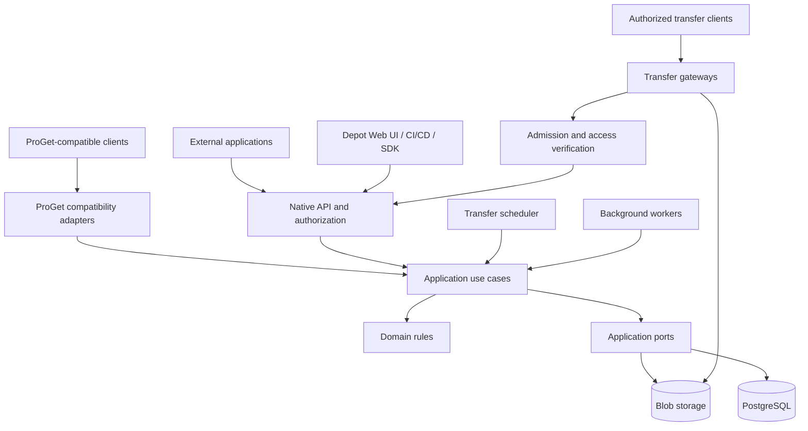

# ProAnima Depot

**English** | [Русский](README.ru.md)

**Self-hosted artifact and file storage with controlled delivery.**

UPack packages, metadata, tagging, collections, transfer queues, and ProGet-compatible APIs.

A **ProAnimaStudio** project. **Ian Panaev** is the author, copyright holder, and owner of the ProAnimaStudio brand.

> **Stage: architecture and development scaffold.** The repository contains documentation, strict TypeScript configuration, module boundaries, and automated quality checks. The storage server, user interface, APIs, queues, and high availability are not implemented yet. Product capabilities described below are planned unless explicitly marked as available.

## Purpose

ProAnima Depot is being designed as an independent service for storing original artifacts, managing their catalog, and delivering them reliably to consumers. Metadata, versions, labels, permissions, and activity history are managed through its own interface and APIs.

The service targets application and content delivery infrastructure: deployment agents, CI/CD pipelines, artifact catalogs, internal tools, and other systems. Depot is deployed and upgraded independently of connected applications.

An initial use case is replacing ProGet for Universal Packages and ordinary files while preserving the HTTP contracts used by existing clients. External applications connect over the network. Their availability must not determine whether Depot can serve packages directly.

## Current status

| Area                                               | Status                                                               |
| -------------------------------------------------- | -------------------------------------------------------------------- |
| Product and technical plan                         | Prepared                                                             |
| Clean architecture and SOLID guidelines            | Documented; import boundaries are checked automatically              |
| Strict TypeScript and npm workspaces               | Configured for ten modules and applications                          |
| Quality checks                                     | Typecheck, type-aware ESLint, Prettier, dependency-cruiser           |
| GitHub Actions                                     | Scaffold checks configured for Linux and Windows                     |
| Ownership and source access                        | Proprietary license; partner permissions require separate agreements |
| APIs, UI, PostgreSQL integration, and blob storage | Planned                                                              |
| 5 GB transfers, queues, load balancing, and HA     | Planned; performance and guarantees are not validated yet            |
| Compatibility with specific ProGet clients         | Requires implementation and contract testing                         |

Empty `src/index.ts` files mark future module boundaries. They are not working applications. Server startup commands and a production image are not available at this stage.

## Planned capabilities

### Packages, files, and catalog

- UPack repositories with groups, names, versions, and original archives preserved during import.
- Ordinary files with directory paths, immutable revisions, and atomic updates of the current revision.
- Schema-based metadata: description, owner, platform, architecture, build/commit, and custom fields.
- Labels, release states, logical collections, filters, and permission-aware search.
- Separate handling of original UPack fields and editable catalog properties.
- Change history and external references that protect artifacts still used by consumers from automatic cleanup.

### Uploads and delivery

- Streaming uploads and downloads with backpressure, cancellation, and bounded buffers.
- Durable multipart upload sessions with size, coverage, and SHA-256 validation.
- GET/HEAD, ETag, Range/If-Range, and download resumption for clients that support it.
- Incomplete or unverified files never appear as published artifacts.
- Downloads remain bound to immutable content even when a file's logical path is updated.

### Queues and networking

- Separate upload, download, and background job queues.
- Priorities, fair allocation across clients, and protection against indefinite waiting.
- Limits on concurrent transfers, bandwidth, staging space, and repository quotas.
- Multiple gateways with admission control and allocated network budgets.
- Controlled migration and replication traffic so background work does not displace operational delivery.

### Security and operations

- Service accounts, repository and action permissions, key rotation, and auditing.
- Short-lived transfer tokens scoped to an object and an action.
- Archive validation, safe paths, and metadata size limits.
- Recovery of intermediate operations, idempotent completion, and integrity checks.
- Metrics, health/readiness endpoints, backups, and tested restoration procedures.

## Architecture



This diagram shows component interactions. Source dependency rules are specified separately in [ARCHITECTURE](docs/ARCHITECTURE.md): the domain is independent of infrastructure, the application layer owns ports, adapters implement those ports, and application entry points assemble dependencies.

Large files are transferred directly through delivery gateways and must not accumulate in API memory. One codebase contains multiple runnable roles; a TypeScript package does not imply a separate server.

### Technology direction

| Layer                     | Direction                                                                           |
| ------------------------- | ----------------------------------------------------------------------------------- |
| Language                  | TypeScript with `strict` and additional indexed-access and optional-property checks |
| Runtime                   | Node.js 24 LTS, ESM                                                                 |
| Code organization         | npm workspaces; domain, application, adapters, and composition roots                |
| HTTP API                  | Fastify, to be introduced with the first working use case                           |
| Metadata and durable jobs | PostgreSQL; integration is planned                                                  |
| Content                   | Local backend and S3-compatible adapter; HA backend selected separately             |
| Delivery gateways         | Nginx with validated admission and bandwidth control                                |
| UI                        | TypeScript; framework not yet selected                                              |
| Quality                   | TypeScript, ESLint, Prettier, dependency-cruiser, GitHub Actions                    |

Development tool versions are pinned in manifests and the lockfile. Runtime dependencies are introduced alongside actual use cases.

## Compatibility and integrations

The native API is planned under `/api/v1`, covering the catalog, metadata, uploads, transfers, external references, events, and administration. Runtime schemas, OpenAPI, and the SDK must remain consistent.

ProGet adapters target the operations used by clients across three API families:

| API family                   | Purpose                                             |
| ---------------------------- | --------------------------------------------------- |
| `/api/packages/{feed}/...`   | Common package operations                           |
| `/upack/{feed}/...`          | Universal Feed API                                  |
| `/endpoints/{directory}/...` | Files, directories, metadata, and multipart uploads |

Compatibility includes response shapes, authentication, error codes, groups, version ordering, overwrite rules, and HTTP behavior—not just URLs. Coverage will be recorded in a real-client matrix and tested against a separate ProGet test instance.

Native clients will be able to create queued jobs, wait for admission, and resume transfers. A legacy client cannot transparently receive `202 + JSON` instead of file bytes: its validated synchronous contract, timeouts, and retry behavior must be respected.

External applications use the public API and a versioned TypeScript SDK. They do not need shared database access or imports of Depot internals. Webhooks are planned with signatures, retries, and deduplication.

## Reliability and scale

The initial design scenario is approximately **4 TB of data** with files **up to 5 GB**. These are requirements, not load-test results. Client concurrency, network capacity, hardware, and recovery objectives still need to be specified.

- **Standalone:** one machine, local storage, and backups; no availability guarantee if that machine fails.
- **Single-site HA:** multiple APIs/gateways, a resilient entry point, HA PostgreSQL, and durable content storage with an agreed write-acknowledgment policy.
- **Multiple sites:** a separate future profile for local delivery, caches, and cross-site replication.

Request balancing does not replace data redundancy. Replication does not replace backups. An active TCP connection breaks if its gateway fails; resumption requires client support. Availability guarantees will be stated only after testing the selected topology.

## Repository layout

```text
apps/
  api/              HTTP API and dependency composition
  worker/           background processing
  scheduler/        transfer scheduling process
  web/              independent Depot interface
packages/
  domain/           pure domain rules and states
  application/      use cases and dependency ports
  contracts/        public API and event schemas
  infrastructure/   database, storage, and external adapters
  proget-compat/    ProGet protocol adapters
  sdk/              public HTTP client
docs/
  adr/              architecture decisions
  templates/        change-description templates
deploy/             future deployment profiles
tests/              future cross-package tests
scripts/            project verification tools
.github/workflows/  GitHub Actions scaffold checks
```

## Development setup

These instructions are intended for the rights holder and developers with separately granted rights. They do not grant a license to use the code.

Use Node.js 24 LTS with current security patches and npm 11. Run the following commands from the repository checkout:

```sh
git clone https://github.com/ProAnima/Depot.git
cd Depot
npm ci
npm run check
```

Access to the private GitHub repository must be granted separately. These commands validate the scaffold; they do not start a storage server.

| Command                      | Purpose                                                          |
| ---------------------------- | ---------------------------------------------------------------- |
| `npm run check`              | Run all current scaffold checks                                  |
| `npm run typecheck`          | Check ten workspaces in their Node/browser environments          |
| `npm run lint`               | Run type-aware ESLint                                            |
| `npm run architecture:check` | Detect cycles, forbidden layer dependencies, and invalid imports |
| `npm run format:check`       | Check formatting                                                 |
| `npm run format`             | Apply formatting                                                 |

Private workspace exports currently point to `.ts` sources for development. Runtime builds with JavaScript/declarations, application startup, and SDK publishing belong to the first implementation stage.

## Development rules

The main contributor instructions are in [AGENTS.md](AGENTS.md) and [CONTRIBUTING.md](CONTRIBUTING.md).

- Domain rules do not depend on HTTP, databases, Node globals, or the UI.
- The application layer owns dependency interfaces; adapters provide implementations.
- Cross-package imports use public entries such as `@proanima/depot-domain`.
- External data is validated at runtime; a type assertion is not validation.
- Strict checking must not be weakened, and `any` must not be used to bypass errors.
- Prefer composition and focused use cases; introduce abstractions for concrete needs.
- Transfers require bounded buffers, cancellation, idempotency, and partial-failure handling.
- Significant contract, durability, and boundary changes are recorded in ADRs.

Scaffold checks are not product tests. A test runner and real unit, contract, and integration scenarios will be added with the first working behavior.

## Implementation roadmap

1. Inventory ProGet behavior and clients; define required contracts and infrastructure.
2. Implement a vertical transfer slice: publish, store, verify, and download 5 GB; test restart and Range.
3. Add catalog metadata, labels/collections, revisions, permissions, audit, and UI.
4. Implement durable queues, quotas, fairness, and multiple gateways.
5. Deliver ProGet compatibility, SDK, and network integrations for external clients.
6. Test HA, backup/restore, and failure scenarios.
7. Perform resumable migration, a pilot, final synchronization, cutover, and rollback validation.

Full stage criteria are in [ROADMAP](docs/ROADMAP.md). The first technical milestone is a verifiable large-file transfer scenario.

## Documentation

The English and Russian READMEs describe the same product scope. Detailed engineering documents are currently maintained in Russian; the proprietary license and attribution notice are in English.

| Document                                     | Contents                                              |
| -------------------------------------------- | ----------------------------------------------------- |
| [PROJECT_PLAN](docs/PROJECT_PLAN.md)         | Detailed product and technical plan                   |
| [ARCHITECTURE](docs/ARCHITECTURE.md)         | Layers and allowed dependencies                       |
| [DOMAIN_MODEL](docs/DOMAIN_MODEL.md)         | Domain entities and invariants                        |
| [API_CONTRACTS](docs/API_CONTRACTS.md)       | Native API, SDK, and ProGet compatibility             |
| [RELIABILITY](docs/RELIABILITY.md)           | Writes, queues, networking, degradation, and recovery |
| [TESTING](docs/TESTING.md)                   | Functional and failure-testing strategy               |
| [CI](docs/CI.md)                             | Current GitHub Actions checks                         |
| [BOOTSTRAP_CHECKS](docs/BOOTSTRAP_CHECKS.md) | Validation of the initial scaffold                    |
| [ROADMAP](docs/ROADMAP.md)                   | Stages and open decisions                             |
| [ADR](docs/adr/README.md)                    | Architecture decision history                         |
| [SECURITY](SECURITY.md)                      | Security requirements                                 |
| [LICENSING](docs/LICENSING.md)               | Ownership and partner licensing model                 |

## License and ownership

**Copyright © 2026 Ian Panaev. All rights reserved.**

ProAnima Depot is proprietary software. Ian Panaev is its author, copyright holder, and owner of the ProAnimaStudio brand. Rights to use, modify, distribute, or maintain private forks are granted to specifically authorized organizations only through separate written agreements with the rights holder, subject to applicable law and other validly granted rights.

Repository access does not replace such an agreement. Permission scope, ownership of modifications, binary distribution, and use of branding are agreed separately. The original source code is not released under MIT, Apache, GPL, or another open-source license.

Repository terms: [LICENSE.md](LICENSE.md). Attribution: [NOTICE.md](NOTICE.md). Third-party components retain their own licenses.
