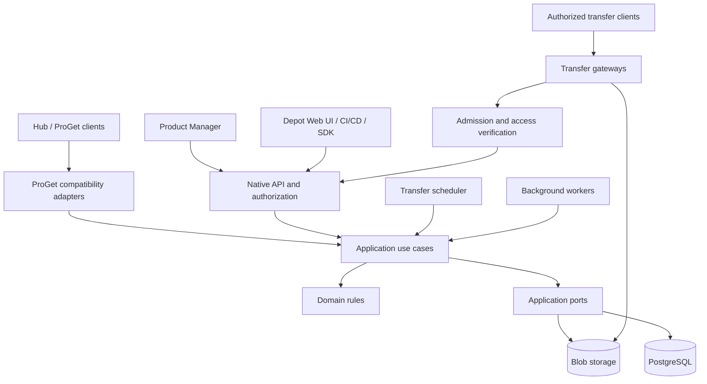

# ProAnima Depot

**Автономное хранилище и доставка пакетов, сборок и файлов.**

Self-hosted artifact and file storage with UPack support, metadata, tagging, transfer queues, and ProGet-compatible APIs.

Проект **ProAnimaStudio**. Автор, правообладатель и владелец бренда ProAnimaStudio — **Ian Panaev**.

> **Стадия: архитектура и каркас разработки.** Подготовлены документация, TypeScript strict, модульная структура и автоматические проверки качества. Рабочий сервер хранения, интерфейс, API, очереди и отказоустойчивость ещё не реализованы. Описанные ниже продуктовые возможности являются планом разработки.

## Назначение

ProAnima Depot проектируется как самостоятельный сервис, который хранит исходные артефакты, управляет их каталогом и надёжно доставляет их потребителям. Метаданные, версии, маркировка, права и история действий доступны через собственный интерфейс и API.

Сервис предназначен для инфраструктуры доставки приложений и контента: Hub-клиентов, CI/CD, продуктовых каталогов, внутренних инструментов и других систем. Развёртывание и обновление Depot независимы от подключённых приложений.

Один из первых сценариев — замена ProGet для Universal Packages и обычных файлов с сохранением используемых клиентами HTTP-контрактов. Product Manager подключается к Depot по сети, в том числе с другого компьютера. Его остановка не должна влиять на прямую раздачу пакетов.

## Что подготовлено сейчас

| Область                                      | Состояние                                                            |
| -------------------------------------------- | -------------------------------------------------------------------- |
| Продуктовый и технический план               | Подготовлен                                                          |
| Чистая архитектура и правила SOLID           | Описаны; границы импортов проверяются автоматически                  |
| TypeScript strict и npm workspaces           | Настроены для десяти модулей/приложений                              |
| Проверки качества                            | Typecheck, type-aware ESLint, Prettier, dependency-cruiser           |
| GitHub Actions                               | Workflow проверок на Linux и Windows добавлен в репозиторий          |
| Авторство и условия доступа к коду           | Проприетарный LICENSE; разрешения партнёрам по отдельным соглашениям |
| API, UI, работа с PostgreSQL и содержимым    | Запланированы                                                        |
| Передача 5 ГБ, очереди, балансировка и HA    | Запланированы; производительность и гарантии ещё не подтверждены     |
| Совместимость с конкретными клиентами ProGet | Требует реализации и контрактных испытаний                           |

Пустые `src/index.ts` обозначают границы будущего кода. Они не являются работающими приложениями. Команд запуска сервера и production-образа на этой стадии нет.

## Планируемые возможности

### Пакеты, файлы и каталог

- UPack-репозитории: группы, имена, версии и исходные архивы без перепаковки при импорте.
- Обычные файлы: дерево путей, неизменяемые ревизии и атомарная смена текущей версии файла.
- Метаданные со схемами: описание, владелец, платформа, архитектура, build/commit и пользовательские поля.
- Метки, статусы выпуска, логические коллекции, фильтры и поиск с учётом прав доступа.
- Раздельное хранение исходных полей UPack и редактируемых свойств каталога.
- История изменений и внешние ссылки: компонент, используемый продуктом, защищён от автоматической очистки.

### Приём и доставка

- Потоковые загрузки и скачивания с backpressure, отменой и ограниченными буферами.
- Устойчивые сессии загрузки частями с проверкой размера, покрытия и SHA-256.
- GET/HEAD, ETag, Range/If-Range и продолжение скачивания поддерживающим это клиентом.
- Незавершённые или непроверенные файлы не появляются как опубликованные.
- Раздача конкретного неизменяемого содержимого, даже если логический путь файла уже обновлён.

### Очереди и сеть

- Отдельные очереди загрузок, скачиваний и фоновых задач.
- Приоритеты, справедливое распределение между клиентами и защита от бесконечного ожидания.
- Лимиты параллельных передач, полосы, временного дискового пространства и квот репозиториев.
- Несколько шлюзов с распределением допусков и сетевых бюджетов.
- Ограничение фоновой миграции и репликации, чтобы они не вытесняли рабочие установки.

### Безопасность и эксплуатация

- Сервисные аккаунты, права на репозитории и отдельные операции, ротация ключей и аудит.
- Короткоживущие токены передачи, ограниченные объектом и действием.
- Проверки архивов, безопасные пути и ограничения размера метаданных.
- Восстановление промежуточных операций, идемпотентное завершение и контроль целостности.
- Метрики, health/readiness, резервные копии и проверяемое восстановление.

## Архитектура



Схема показывает взаимодействие компонентов. Направление зависимостей исходного кода задаётся отдельно в [архитектуре](docs/ARCHITECTURE.md): домен независим от инфраструктуры, application определяет порты, адаптеры реализуют их, приложения собирают зависимости.

Большие файлы передаются через файловые шлюзы. Они не проходят через Product Manager и не должны накапливаться целиком в памяти API. Один проект содержит несколько запускаемых ролей; каждый TypeScript-пакет не требует отдельного сервера.

### Технологическое направление

| Слой                           | Решение                                                                     |
| ------------------------------ | --------------------------------------------------------------------------- |
| Язык                           | TypeScript с `strict`, дополнительными проверками индексов и optional-полей |
| Runtime                        | Node.js 24 LTS, ESM                                                         |
| Организация кода               | npm workspaces; domain, application, adapters и composition roots           |
| HTTP API                       | Fastify, подключается с первым рабочим сценарием                            |
| Метаданные и устойчивые задачи | PostgreSQL, интеграция запланирована                                        |
| Содержимое                     | Local backend и S3-совместимый adapter; HA backend выбирается отдельно      |
| Файловые шлюзы                 | Nginx и проверяемое управление допусками/полосой                            |
| UI                             | TypeScript; framework ещё не выбран                                         |
| Качество                       | TypeScript, ESLint, Prettier, dependency-cruiser, GitHub Actions            |

Версии dev-инструментов зафиксированы в manifests и lock-файле. Runtime-зависимости вводятся вместе с реальными сценариями.

## Совместимость и интеграции

Собственный API проектируется под `/api/v1`: каталог, metadata, uploads, transfers, внешние ссылки, события и администрирование. Runtime-схемы, OpenAPI и SDK должны оставаться согласованными.

Адаптеры ProGet покрывают используемые операции трёх семейств:

| Семейство                    | Назначение                                    |
| ---------------------------- | --------------------------------------------- |
| `/api/packages/{feed}/...`   | Общие операции с пакетами                     |
| `/upack/{feed}/...`          | Universal Feed API                            |
| `/endpoints/{directory}/...` | Обычные файлы, каталоги, metadata и multipart |

Совместимость включает не только URL, но и формы ответов, авторизацию, коды ошибок, группы, сортировку версий, перезапись и поведение HTTP. Объём поддержки фиксируется матрицей реальных клиентов и проверяется на отдельном тестовом ProGet.

Нативный клиент сможет получать задания очереди, ожидать допуск и продолжать передачу. Старому клиенту нельзя незаметно заменить файл на `202 + JSON`: для него сохраняется проверенный синхронный контракт и учитываются его тайм-ауты/повторы.

Product Manager использует публичное API, затем TypeScript SDK после своего переноса. Общая БД и прямые импорты внутреннего кода Depot не требуются. Webhooks проектируются с подписями, повторной доставкой и дедупликацией.

## Надёжность и масштабирование

Исходный сценарий проектирования — около **4 ТБ данных** и файлы **до 5 ГБ**. Это требования, а не результаты нагрузочного тестирования. Число клиентов, сеть, оборудование и RPO/RTO ещё уточняются.

- **Standalone:** одна машина, local backend и backup; не гарантирует доступность при потере машины.
- **HA на площадке:** несколько API/шлюзов, доступный входной адрес, HA PostgreSQL и отказоустойчивое содержимое с согласованной политикой подтверждения записи.
- **Несколько площадок:** отдельный будущий профиль локальной доставки, кешей и межплощадочной репликации.

Балансировка запросов не заменяет резервирование данных. Репликация не заменяет backup. При падении шлюза уже открытое TCP-соединение обрывается; возобновление требует поддержки клиента. Заявлять гарантии доступности будем после испытаний выбранной топологии.

## Структура репозитория

```text
apps/
  api/              HTTP API и сборка зависимостей
  worker/           фоновые обработчики
  scheduler/        процесс планирования передач
  web/              автономный интерфейс Depot
packages/
  domain/           чистые предметные правила и состояния
  application/      сценарии и порты внешних зависимостей
  contracts/        публичные схемы API и событий
  infrastructure/   адаптеры БД, хранилища и внешних систем
  proget-compat/    адаптеры протоколов ProGet
  sdk/              публичный HTTP-клиент
docs/
  adr/              архитектурные решения
  templates/        шаблоны описания изменений
deploy/             будущие профили развёртывания
tests/              будущие межпакетные испытания
scripts/            средства проверки проекта
.github/workflows/  проверки каркаса в GitHub Actions
```

## Подготовка окружения

Инструкции предназначены для правообладателя и разработчиков с отдельно предоставленными правами. Они сами по себе не предоставляют лицензию на использование кода.

Нужны Node.js 24 LTS с актуальными исправлениями безопасности и npm 11. Выполняйте команды из корня клонированного репозитория:

```sh
git clone https://github.com/ProAnima/Depot.git
cd Depot
npm ci
npm run check
```

Для закрытого репозитория GitHub необходим предоставленный доступ. Команды проверяют каркас; сервер хранения пока не запускается.

| Команда                      | Назначение                                              |
| ---------------------------- | ------------------------------------------------------- |
| `npm run check`              | Все действующие проверки каркаса                        |
| `npm run typecheck`          | Проверка десяти workspaces с их Node/browser окружением |
| `npm run lint`               | ESLint с информацией о типах                            |
| `npm run architecture:check` | Циклы, границы слоёв и недопустимые импорты             |
| `npm run format:check`       | Проверка форматирования                                 |
| `npm run format`             | Применение форматирования                               |

Сейчас private workspace exports указывают на `.ts` для разработки. Runtime-сборка с JS/declarations, запуск приложений и публикация SDK входят в первый рабочий этап.

## Правила разработки

Основные инструкции находятся в [AGENTS.md](AGENTS.md) и [CONTRIBUTING.md](CONTRIBUTING.md).

- Предметные правила не зависят от HTTP, БД, Node globals или UI.
- Интерфейсы внешних зависимостей принадлежат application; реализации находятся в adapters.
- Межпакетные импорты используют публичные exports вида `@proanima/depot-domain`.
- Внешние данные проверяются во время выполнения; `as` не заменяет валидацию.
- Не ослабляем strict и не используем `any` для обхода ошибок.
- Предпочитаем композицию и небольшие сценарии; абстракции добавляются под реальную потребность.
- Для передач обязательны ограниченные буферы, отмена, идемпотентность и обработка частичного отказа.
- Изменения важных контрактов, долговечности и границ фиксируются в ADR.

Проверки каркаса не являются продуктовыми тестами. Тестовый runner и реальные unit/contract/integration сценарии добавляются вместе с первым работающим поведением.

## Порядок реализации

1. Инвентаризация ProGet и клиентов, определение обязательных контрактов и инфраструктуры.
2. Сквозная передача: публикация, хранение, проверка и скачивание 5 ГБ, перезапуск и Range.
3. Каталог, metadata, labels/collections, ревизии, права, аудит и UI.
4. Устойчивые очереди, квоты, fairness и несколько шлюзов.
5. Совместимость ProGet, SDK и интеграция Product Manager по сети.
6. Испытания HA, backup/restore и отказных режимов.
7. Возобновляемая миграция, пилот, финальная синхронизация, переключение и откат.

Полные критерии этапов: [ROADMAP](docs/ROADMAP.md). Первый технический результат — проверяемый сценарий передачи большого файла.

## Документация

| Документ                                     | Содержание                                         |
| -------------------------------------------- | -------------------------------------------------- |
| [PROJECT_PLAN](docs/PROJECT_PLAN.md)         | Подробный продуктовый и технический план           |
| [ARCHITECTURE](docs/ARCHITECTURE.md)         | Слои и разрешённые зависимости                     |
| [DOMAIN_MODEL](docs/DOMAIN_MODEL.md)         | Предметные сущности и инварианты                   |
| [API_CONTRACTS](docs/API_CONTRACTS.md)       | Нативный API, SDK и совместимость ProGet           |
| [RELIABILITY](docs/RELIABILITY.md)           | Запись, очереди, сеть, деградация и восстановление |
| [TESTING](docs/TESTING.md)                   | Стратегия функциональных и отказных испытаний      |
| [CI](docs/CI.md)                             | Действующие проверки GitHub Actions                |
| [BOOTSTRAP_CHECKS](docs/BOOTSTRAP_CHECKS.md) | Что проверено в исходном каркасе                   |
| [ROADMAP](docs/ROADMAP.md)                   | Этапы и открытые решения                           |
| [ADR](docs/adr/README.md)                    | История архитектурных решений                      |
| [SECURITY](SECURITY.md)                      | Требования безопасности                            |
| [LICENSING](docs/LICENSING.md)               | Правообладатель и модель разрешений партнёрам      |

## Лицензия и авторство

**Copyright © 2026 Ian Panaev. All rights reserved.**

ProAnima Depot — проприетарный проект. Ian Panaev является автором, правообладателем и владельцем бренда ProAnimaStudio. Права на использование, изменение, распространение и создание приватных форков предоставляются определённым компаниям только отдельными письменными соглашениями с правообладателем, с учётом применимого закона и иных уже предоставленных прав.

Наличие доступа к репозиторию не заменяет такое соглашение. Объём разрешений, права на доработки, распространение сборок и использование бренда определяются отдельно. Исходный код не публикуется под MIT, Apache, GPL или другой открытой лицензией.

Полные условия репозитория: [LICENSE.md](LICENSE.md). Уведомление об авторстве: [NOTICE.md](NOTICE.md). Сторонние компоненты сохраняют собственные лицензии.
