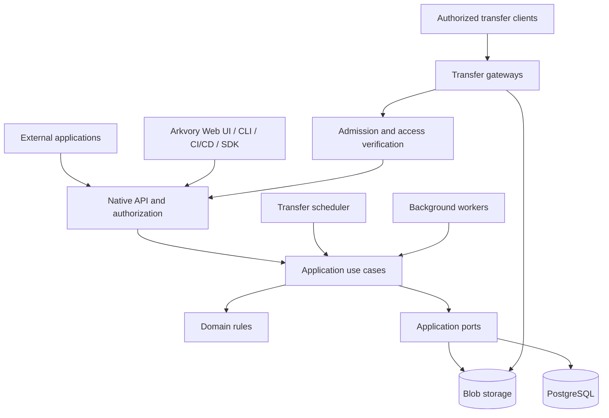

# ProAnima Arkvory


**English** | [Русский](README.ru.md)

**Self-hosted artifact and file storage with controlled delivery.**

UPack packages and ordinary files, metadata, tagging, collections, transfer queues, and a convenient native API, SDK and CLI.

A **ProAnimaStudio** project. **Ian Panaev** is the author, copyright holder, and owner of the Arkvory and ProAnimaStudio brands.

[Brand assets](branding/README.md) · [Product identity](docs/PRODUCT_IDENTITY.md)

> **Stage: standalone 0.2, under development.** Native API, multipart/resume, UPack/assets catalog, metadata, worker, admission queues, online physical cleanup, offline repair/scrub, SDK and web console are implemented. Read gateways with leased shares of a common download budget are implemented for shared storage. Two-server replication is not ready.

Logical artifact deletion is available through API, SDK and the RU/EN console with an explicit scoped permission, dependency checks and revision protection. Retention previews and applies only selected IDs; physical reclamation runs in the background after a configurable grace period, without stopping uploads or downloads. [Online cleanup](docs/ONLINE_CLEANUP.md). [Lifecycle contract](docs/ARTIFACT_RETENTION.md).

## Purpose

ProAnima Arkvory is being designed as an independent service for storing original artifacts, managing their catalog, and delivering them reliably to consumers. Metadata, versions, labels, permissions, and activity history are managed through its own interface and APIs.

The service targets application and content delivery infrastructure: deployment agents, CI/CD pipelines, artifact catalogs, internal tools, and other systems. Arkvory is deployed and upgraded independently of connected applications.

Arkvory is a standalone artifact storage with its own convenient HTTP API, TypeScript SDK and `arkvoryctl` CLI; it does not emulate third-party repository protocols. External applications connect over the network. Their availability must not determine whether Arkvory can serve packages directly.

## Current status

API discovery now exposes credential-scoped operations and six responsibility areas, with separate visibility metadata and OpenAPI views. The SDK adds identity, administration and repository namespaces while retaining existing methods. [Integration contract](docs/API_SURFACES.md).

The RU/EN console includes direct catalog downloads, compact mobile navigation, contextual queue controls and grouped access-management forms. [UI behavior and browser acceptance](docs/CONSOLE_UX.md).

| Area                                                                  | Status                                                         |
| --------------------------------------------------------------------- | -------------------------------------------------------------- |
| Strict TypeScript, clean boundaries, runtime builds                   | Implemented                                                    |
| Streaming transfers, SHA-256, GET/HEAD/Range/ETag                     | Implemented                                                    |
| Adaptive parts (8 MiB–1 GiB), resume, TTL, idempotent completion      | Implemented                                                    |
| Bounded SDK retries, verified Range downloads, saved-prefix resume    | Implemented; [recovery guide](docs/TRANSFER_RECOVERY.md)       |
| Metadata/labels/collections, CAS, search, catalog audit               | Implemented                                                    |
| UPack manifest/group/SemVer, immutable versions, asset revisions      | Implemented with validator limits                              |
| PostgreSQL completion jobs, lease/generation, retries, worker         | Implemented                                                    |
| Bounded upload/download admission with client rotation                | One gateway, in memory                                         |
| Shared-storage read gateways and fixed aggregate download shares      | Implemented; PostgreSQL leases, no node failover               |
| GC and scrub                                                          | Online bounded cleanup; offline repair/scrub                   |
| SDK and RU/EN web console                                             | Implemented; details in runbook                                |
| External browser UI through Bearer API and explicit origin allowlist  | Implemented for native API; [setup](docs/EXTERNAL_UI.md)       |
| Asset history, exact revision lookup, atomic restore with audit       | API, SDK and console implemented                               |
| User accounts and repository access groups                            | Administrator registration, sessions and group grants          |
| Package catalog sorting, grouping and cursor paging                   | API, SDK and console; up to 100 versions per page              |
| Download by package identity or file path                             | Implemented; same ACL, Range and limits as by ID               |
| Directory import with resume and download/hash verification           | Implemented; metadata and ACL mapping separate                 |
| Structured JSON logs, levels, request→job→audit correlation, metrics  | Implemented; [runbook](docs/CORE_RUNBOOK.md), ADR 0052         |
| Error codes with reasons and field details; request ID in UI and CLI  | Implemented; [error contract](docs/API_CONTRACTS.md), ADR 0051 |
| Built-in HTTPS with certificate reload; reverse proxy still supported | Implemented; ADR 0055                                          |
| Consistent backup to disk/NAS, verify, restore to an empty target     | Operator CLI, unencrypted vault; ADR 0054                      |
| Local CI lanes (Windows, Linux, systemd) and draft releases           | Implemented; [local pipeline](docs/CI.md), ADR 0053            |
| Two-server replication, failover, global balancing                    | Design stage; lab validation deferred                          |

Run `npm run migrate`, `npm start` and `npm run worker` separately. Console: `/console/`. This is a development release, not a production HA system. See the [core runbook](docs/CORE_RUNBOOK.md), [0.2 features](docs/LIFECYCLE_AND_CATALOG.md), [import and migration](docs/MIGRATION.md), [two-server profile](docs/TWO_NODE_PLAN.md) and [validation](docs/CORE_VALIDATION.md) (engineering documents in Russian).

## Capabilities and direction

The standalone gateway now supports aggregate upload/download rate ceilings, a shared ceiling per principal across keys and connections, per-principal active transfer caps, and authenticated readiness diagnostics. Rates are configurable and disabled by default; active transfer defaults are one upload and up to four downloads per principal. These budgets belong to one process. See [traffic control](docs/TRAFFIC_CONTROL.md).

An optional shared-storage profile runs one writer and additional read gateways. Fixed download shares are reserved through finite PostgreSQL leases; a lost lease stops delivery until restart. Idle shares are not redistributed. See [read gateways](docs/READ_GATEWAYS.md).

The console has light, dark and system themes, live English/Russian switching, and responsive catalog, upload, history and artifact screens. Colors, typography, spacing, radii, controls and motion use centralized design tokens. The browser stores appearance/language preferences and private download checkpoints with a recovery journal; credentials remain in memory. See the [design system](docs/DESIGN_SYSTEM.md) and [download recovery and storage limits](docs/DOWNLOAD_QUEUE.md).

A UI hosted on another HTTPS origin can use the native API with Bearer tokens and a server configured origin allowlist. The bundled console also accepts a configured Arkvory API address. See the [external UI guide](docs/EXTERNAL_UI.md).

Administrators can create accounts and repository access groups. Users sign in with 12-hour sessions and can change their own password; the console keeps session tokens only in the current tab and suggests readable repositories after sign-in. Personal access tokens are created from a session only, expire within 365 days (90 by default), are `read` or `read-write`, never carry administrator rights and are revoked by any password change. Sign-in and optional self-registration are throttled per client with a bounded account backoff instead of lockout, and identity changes are recorded in an append-only security journal. See [identity and tokens](docs/IDENTITY.md). The package screen sorts by group, name or SemVer version and groups by UPack group or package. See the [runbook](docs/CORE_RUNBOOK.md).

### Packages, files, and catalog

- UPack repositories with groups, names, versions, and original archives preserved during import.
- Ordinary files with directory paths, immutable revisions, and atomic updates of the current revision.
- Flat string metadata: description, owner, platform, architecture, build/commit, and custom fields. Schema validation is planned.
- Labels, logical collections, filters, and permission-aware search. Release approvals and state workflows are planned.
- Separate handling of original UPack fields and editable catalog properties.
- Change history and external references that protect artifacts still used by consumers from automatic cleanup.

### Uploads and delivery

- Streaming uploads and downloads with backpressure, cancellation, and bounded buffers.
- Durable multipart upload sessions with size, coverage, and SHA-256 validation.
- GET/HEAD, ETag, Range/If-Range, and download resumption for clients that support it.
- Incomplete or unverified files never appear as published artifacts.
- Downloads remain bound to immutable content even when a file's logical path is updated.

### Queues and networking

- Separate upload, download, and background job queues.
- Client rotation and bounded admission waiting; server-side priorities and starvation guarantees under mixed load remain planned.
- Limits on concurrent transfers, bandwidth, staging space, and repository quotas.
- Multiple gateways with admission control and allocated network budgets.
- Planned: coordinated migration and replication budgets that preserve operational delivery capacity.

### Security and operations

- Service accounts, repository and action permissions, key rotation, and auditing.
- One authentication scheme for service keys and user sessions: `Authorization: Bearer`.
- Planned: short-lived transfer tokens scoped to an object and an action; current downloads require ordinary API authorization.
- Archive validation, safe paths, and metadata size limits.
- Recovery of intermediate operations, idempotent completion, and integrity checks.
- Health/readiness and transfer diagnostics are implemented. A manual consistent backup of the database and blobs into a built-in vault, its verification and a restore into an empty target run through the operator CLI `npm run backup` (ADR 0054); schedules, encryption, S3 and a backup UI remain [planned](docs/BACKUP_RECOVERY.md).

## Architecture



This diagram shows component interactions. Source dependency rules are specified separately in [ARCHITECTURE](docs/ARCHITECTURE.md): the domain is independent of infrastructure, the application layer owns ports, adapters implement those ports, and application entry points assemble dependencies.

Large files are transferred directly through delivery gateways and must not accumulate in API memory. One codebase contains multiple runnable roles; a TypeScript package does not imply a separate server.

### Technology direction

| Layer                     | Direction                                                                           |
| ------------------------- | ----------------------------------------------------------------------------------- |
| Language                  | TypeScript with `strict` and additional indexed-access and optional-property checks |
| Runtime                   | Node.js 24 LTS, ESM                                                                 |
| Code organization         | npm workspaces; domain, application, adapters, and composition roots                |
| HTTP API                  | Fastify, implemented for the native core                                            |
| Metadata and durable jobs | PostgreSQL; catalog and migrations implemented                                      |
| Content                   | Local backend implemented; S3 and HA backend planned                                |
| Delivery gateways         | Node.js gateway implemented; dedicated Nginx delivery integration planned           |
| UI                        | TypeScript; framework not yet selected                                              |
| Quality                   | TypeScript, ESLint, Prettier, dependency-cruiser, GitHub Actions                    |

Development tool versions are pinned in manifests and the lockfile. Runtime dependencies are introduced alongside actual use cases.

## API and integrations

The [API map](docs/API_MAP.md) documents current routes, permissions and limitations. [Managed service keys](docs/SERVICE_KEYS.md) now support exact repository actions, one-time issuance, activation, rotation, expiry and revocation, with API/worker/reader enforcement and SDK support. The broader [service access model](docs/API_ACCESS.md) and [API evolution plan](docs/API_EVOLUTION.md) retain recursive roles, legacy identity import, namespace selectors and integration scaling as future work. Engineering documents are in Russian.

Scoped service administration is implemented: bootstrap assigns a managed operator key to exact target accounts with seven administrative actions and a repository permission ceiling. Operators cannot administer themselves or delegate further; rotation does not copy administrative grants. Issued pending keys recheck the issuer at activation, while already activated consumer keys require explicit revocation. API/SDK and [web administration](docs/WEB_ADMINISTRATION.md) are available for accounts, policies, keys, delegation and audit. See the [delegation contract and upgrade procedure](docs/SERVICE_DELEGATION.md).

Large file catalogs can be traversed with the new cursor-based `assets/page` API and SDK: bounded pages, literal prefix filters, access checks on every request and an indexed seek. The original assets list remains compatible. See [asset pagination and schema 11](docs/ASSET_PAGINATION.md).

Repository discovery exposes only the caller’s logical repository scopes, including empty ones, with a paginated directory and cards showing supported formats and effective permissions. Managed credentials opt in with `repository.read`; content and administration remain separate. API and SDK are available. See the [discovery contract](docs/REPOSITORY_DISCOVERY.md).

The native API under `/api/v1` covers multipart uploads, completion jobs, content delivery, mutable annotations, package/asset catalogs, asset history and restoration, external references and catalog audit. OpenAPI is served at `/api/v1/openapi.json`; the build also exports `packages/contracts/dist/openapi.json`. All registered API operations, including HEAD, have stable operation IDs and explicit access/retry metadata, checked against runtime routes at startup and in CI. See the [contract guard](docs/API_CONTRACT_GUARD.md). User and group administration is implemented; distributed transfers, events/webhooks and extended service administration remain planned. Runtime response validation, OpenAPI and the TypeScript SDK are maintained together.

Content can be downloaded by artifact ID or by name:

| Route under `/api/v1/repositories/{repository}`   | Returns                                    |
| ------------------------------------------------- | ------------------------------------------ |
| `GET/HEAD artifacts/{id}/content`                 | Immutable bytes of one artifact            |
| `GET/HEAD packages/content?group=&name=&version=` | Original UPack archive of an exact version |
| `GET/HEAD packages/content?group=&name=`          | Highest stable SemVer; see range and stage |
| `GET/HEAD asset/content?path=`                    | Current revision of a file path            |

Name-based routes resolve the target on every request and then follow the same ACL (`content.read`), admission, bandwidth and Range/ETag/If-Range rules as downloads by ID. To resume, send `If-Range` with the returned ETag or pin the artifact ID. Third-party repository protocols are not emulated; see [ADR 0045](docs/adr/0045-native-only-api.md).

Native clients will be able to create queued transfer jobs, wait for admission, and resume transfers. Synchronous download routes keep returning file bytes rather than `202 + JSON`.

External applications use the public API and the portable TypeScript SDK in this workspace. They do not need shared database access or imports of Arkvory internals. Webhooks are planned with signatures, retries, and deduplication.

## Reliability and scale

The initial design scenario is approximately **4 TB of data** with objects of **tens of gigabytes and more**. There is no fixed object size limit: the multipart layout addresses up to 10 000 parts of up to 1 GiB (about 10 TiB), and operators may set a lower `ARKVORY_MAX_OBJECT_BYTES`; quotas and free space are the practical bounds. Streaming transfers and multipart uploads do not depend on object size for memory usage. A single 5 GiB transfer and restart have been tested locally; see the validation report. Client concurrency, network capacity, hardware, and recovery objectives still need to be specified.

- **Standalone:** one machine, local storage, and backups; no availability guarantee if that machine fails.
- **Single-site HA:** multiple APIs/gateways, a resilient entry point, HA PostgreSQL, and durable content storage with an agreed write-acknowledgment policy.
- **Multiple sites:** a separate future profile for local delivery, caches, and cross-site replication.

Request balancing does not replace data redundancy. Replication does not replace backups. An active TCP connection breaks if its gateway fails; resumption requires client support. Availability guarantees will be stated only after testing the selected topology.

Independent replication is now specified as two separate planned profiles: portable asynchronous mirrors and infrastructure-backed synchronous HA. Durable copy acknowledgements, GC protection, administration APIs and UI flows are documented; no replication runtime or writer failover is implemented yet. [Replication design and delivery stages](docs/REPLICATION.md), [administration API](docs/REPLICATION_API.md), [UI/UX](docs/REPLICATION_UX.md).

## Repository layout

```text
apps/
  api/              HTTP API and dependency composition
  worker/           background processing
  scheduler/        transfer scheduling process
  web/              independent Arkvory interface
packages/
  domain/           pure domain rules and states
  application/      use cases and dependency ports
  contracts/        public API and event schemas
  infrastructure/   database, storage, and external adapters
  sdk/              public HTTP client
docs/
  adr/              architecture decisions
  templates/        change-description templates
deploy/             future deployment profiles
tests/              unit, integration and large transfer tests
scripts/            project verification tools
.github/workflows/  GitHub Actions scaffold checks
```

## Development setup

For authorized developers under the proprietary license. Requires Node.js 24 LTS, npm 11, PostgreSQL 18, and a local filesystem supporting hard links. Docker is optional if PostgreSQL is already available.

```sh
git clone https://github.com/ProAnima/Arkvory.git
cd Arkvory
npm ci
npm run build
npm run init:local
docker compose --env-file .env -f deploy/compose.dev.yml up -d --wait
npm run migrate
npm start
```

Local initialization generates private credentials under ignored `data/` and `.env`; it refuses to overwrite an existing configuration. The API binds to `127.0.0.1:8080`. Upload from another terminal with `npm run upload -- ./example.upack releases`. The CLI prints an artifact URL; requests require the generated Bearer key.

For an existing database, edit `ARKVORY_DATABASE_URL` in `.env` instead of starting Compose. See the [runbook](docs/CORE_RUNBOOK.md) for configuration, permissions, recovery, and network access with TLS.

| Command                    | Purpose                                                              |
| -------------------------- | -------------------------------------------------------------------- |
| `npm run check`            | Formatting, types, ESLint, architecture boundaries                   |
| `npm run build`            | Compile all workspaces to JavaScript and declarations                |
| `npm test`                 | Build and run domain/range/local-storage tests                       |
| `npm run test:integration` | Real PostgreSQL and HTTP tests; requires `ARKVORY_TEST_DATABASE_URL` |
| `npm run test:large`       | 5 GiB HTTP upload/download, process restart, hash and RSS checks     |
| `npm run format`           | Apply formatting                                                     |

Multipart uploads resume from recorded parts (the session fixes the part size; clients over 16 GiB complete through the worker); whole-file PUT retries restart from byte zero. Online cleanup releases cancelled reservations after deleting their content and the grace period. One API process owns a standalone database; this profile provides no node failover. Keep the database and the entire storage directory, including `storage-id`, together in backup/restore procedures. Before updating, stop API/worker, back up both, run `npm run migrate` (schema 25), then start the new code. See [asset history and restore](docs/LIFECYCLE_AND_CATALOG.md#история-и-восстановление-файлов) and [online catalog indexes](docs/adr/0014-online-package-page-indexes.md).

## Development rules

The main contributor instructions are in [AGENTS.md](AGENTS.md) and [CONTRIBUTING.md](CONTRIBUTING.md).

- Domain rules do not depend on HTTP, databases, Node globals, or the UI.
- The application layer owns dependency interfaces; adapters provide implementations.
- Cross-package imports use public entries such as `@proanima/arkvory-domain`.
- External data is validated at runtime; a type assertion is not validation.
- Strict checking must not be weakened, and `any` must not be used to bypass errors.
- Prefer composition and focused use cases; introduce abstractions for concrete needs.
- Transfers require bounded buffers, cancellation, idempotency, and partial-failure handling.
- Significant contract, durability, and boundary changes are recorded in ADRs.

The Node.js test runner covers the first working scenarios. Static checks alone do not establish storage durability or availability.

## Implementation roadmap

1. Inventory consumers and scenarios; define required contracts and infrastructure.
2. Implement a vertical transfer slice: publish, store, verify, and download 5 GB; test restart and Range.
3. Add catalog metadata, labels/collections, revisions, permissions, audit, and UI.
4. Implement durable queues, quotas, fairness, and multiple gateways.
5. Deliver the native API, SDK, CLI, and network integrations for external clients.
6. Test HA, backup/restore, and failure scenarios.
7. Perform resumable migration, a pilot, final synchronization, cutover, and rollback validation.

Full stage criteria are in [ROADMAP](docs/ROADMAP.md). The first standalone transfer scenario is implemented; replicated delivery remains a separate milestone. Read gateways, fixed aggregate quotas and the offline upgrade procedure are documented in [READ_GATEWAYS](docs/READ_GATEWAYS.md). Stop all readers as well as the writer and worker before maintenance or changing the shared policy.

## Documentation

The English and Russian READMEs describe the same product scope. Detailed engineering documents are currently maintained in Russian; the proprietary license and attribution notice are in English.

| Document                                     | Contents                                              |
| -------------------------------------------- | ----------------------------------------------------- |
| [CORE_RUNBOOK](docs/CORE_RUNBOOK.md)         | Running the native core, API, configuration, recovery |
| [CORE_VALIDATION](docs/CORE_VALIDATION.md)   | Measured standalone test results and limitations      |
| [PROJECT_PLAN](docs/PROJECT_PLAN.md)         | Detailed product and technical plan                   |
| [ARCHITECTURE](docs/ARCHITECTURE.md)         | Layers and allowed dependencies                       |
| [DOMAIN_MODEL](docs/DOMAIN_MODEL.md)         | Domain entities and invariants                        |
| [API_CONTRACTS](docs/API_CONTRACTS.md)       | Native API, SDK, and download contracts               |
| [RELIABILITY](docs/RELIABILITY.md)           | Writes, queues, networking, degradation, and recovery |
| [TESTING](docs/TESTING.md)                   | Functional and failure-testing strategy               |
| [CI](docs/CI.md)                             | Current GitHub Actions checks                         |
| [BOOTSTRAP_CHECKS](docs/BOOTSTRAP_CHECKS.md) | Validation of the initial scaffold                    |
| [ROADMAP](docs/ROADMAP.md)                   | Stages and open decisions                             |
| [ADR](docs/adr/README.md)                    | Architecture decision history                         |
| [SECURITY](SECURITY.md)                      | Security requirements                                 |
| [LICENSING](docs/LICENSING.md)               | Ownership and partner licensing model                 |

## License and ownership

**Copyright © 2026 Ian Panaev. All rights reserved.**

ProAnima Arkvory is proprietary software. Ian Panaev is its author, copyright holder, and owner of the ProAnimaStudio brand. Rights to use, modify, distribute, or maintain private forks are granted to specifically authorized organizations only through separate written agreements with the rights holder, subject to applicable law and other validly granted rights.

Repository access does not replace such an agreement. Permission scope, ownership of modifications, binary distribution, and use of branding are agreed separately. The original source code is not released under MIT, Apache, GPL, or another open-source license.

Repository terms: [LICENSE.md](LICENSE.md). Attribution: [NOTICE.md](NOTICE.md). Third-party components retain their own licenses.

Downloads now have a bounded client queue in the SDK and console: pause/resume from private disk staging, cancellation, waiting-queue cleanup, concurrency and start-delay controls. The final destination is saved only after checksum verification. An OPFS journal and sealed 8 MiB segments restore unfinished downloads after a page reload: reconnect, restore the queue, then choose destinations to resume. Credentials and destination handles are not persisted. These are not distributed server jobs. [Download queue and limits](docs/DOWNLOAD_QUEUE.md).

### Promotion and version resolution

Builds move from CI to production in two compatible ways. **Stages** are controlled labels (`qa`, `release`, `prod`; up to 16 per artifact) that change only through the promotion API with the `artifact.promote` permission; every change is journaled with actor, time and comment, and staged artifacts are protected from retention. **Repository promotion** publishes an artifact in another repository (`dev` → `staging` → `prod`) without transferring bytes again: `copy` keeps the source, `move` retires it in the same transaction. Repeating a promotion returns the existing copy.

Deploy agents ask for a version instead of an ID: `packages/resolve` and `packages/content` accept an exact version or a SemVer range (`^1.4`, `>=1.0.0 <2.0.0`), a stage, prerelease opt-in and `order=promoted` for "most recently promoted", so rollback is a stage change. A key with only `content.read` can download the selected version. API, SDK (`client.promotions`, `inRepository(...).stages/promotions/packages.resolve`) and CLI (`arkvoryctl promote`, `stages`, `packages resolve|download`, `promotions journal`); the console shows stages, promotion history and a promote form on the artifact page and stage chips in the package list. Schema 22. [Promotion guide](docs/PROMOTION.md), [ADR 0047](docs/adr/0047-artifact-promotion.md).

### Build metadata and attachments

Published artifacts support editable labels, text metadata and collections, plus versioned links to manifests, SBOMs, signatures, reports and additional files in the same repository. The console offers metadata fields, label presets, direct resumable attachment uploads and history/restore. Concurrent edits use revision checks; unlinking preserves original files. APIs are grouped under catalog, with the same repository authorization and SDK support. Requires database migration 12. [Contract, limits and examples](docs/BUILD_DETAILS.md).

### Storage policies and diagnostics

Automatic retention keeps the last N registered UPack builds per package/channel, per package or across a repository, while preserving protected labels and reference/history pins. Repository quotas include pending uploads and retired bytes until physical GC. API, SDK and RU/EN console expose revisioned settings, previews, usage and bounded warning/error history. New managed permissions are `storage.read`, `storage.manage` and `diagnostics.read`; activation also requires `artifact.delete`. Scheduling rechecks the enabling key and stops when its authority expires. Policies start disabled. Migration 15 is required. Online physical cleanup has separate, revisioned settings: grace, batch size, interval, delay and live pause. Active transfers and referenced content are protected; quota is released after deletion succeeds. It starts disabled and requires all processes upgraded to schema 17. [Online cleanup](docs/ONLINE_CLEANUP.md). [Contract and operations](docs/STORAGE_POLICIES.md).

`npm run upack:manifest -- --input manifest.json --metadata custom.json --output upack.json` prepares embedded custom UPack metadata before packaging. It preserves nested `_` fields without modifying published archives.

### Engineering gates

`npm run gate -- quick` checks architecture, formatting, strict types, lint, build and unit tests. `verify` also requires PostgreSQL, browser acceptance and dependency audit; `release` adds both real 5 GiB failure/recovery scenarios. CI runs quality checks on Windows/Linux and requires database/browser/security lanes. Limits are 500 code lines per file, 300 per class and 100 per function; existing exceptions are explicit, frozen and expire. [Setup, extension and reports](docs/ENGINEERING_GATES.md), [architecture audit](docs/ARCHITECTURE_AUDIT_2026-09-25.md).

### Installation and stable updates

The administrator console announces new stable releases and provides manual installation with confirmation, automatic installation settings and a UTC maintenance hour. Release checks continue when automatic installation is off. A separate host updater executes bounded requests; the API has no shell access or GitHub credential. [Update controls, API and recovery](docs/UPDATES.md).

Native installers: **Arkvory-Setup-x64.exe** (RU/EN wizard, bundled Node.js/PostgreSQL/WinSW/VC++ runtime, owner account and onboarding), **Arkvory-amd64.deb** and **Arkvory-x86_64.rpm** (bundled Node.js; database dependencies resolved by the package manager). Windows setup works offline. Native packages and data-preserving uninstall have dedicated CI gates. RPM distribution acceptance and publisher signing remain release prerequisites. The console includes guided setup and a permission-aware API catalogue with CLI help.

Stable updates use verified GitHub Releases, optional automatic updates, version pinning and same-schema rollback. Data and configuration remain separate from code; the database has its own supervised service. PostgreSQL major upgrades and installed runtime maintenance are separate operator actions. Advanced script/Compose installation remains available; CMD launchers have been removed. [Installation and platform requirements](deploy/README.md).

### Remote CLI

**Arkvory Remote Setup** is included in the client installers. Its RU/EN browser wizard checks an SSH host, installs a stable native release with dependencies and services, creates the owner, verifies readiness and forwards the console to a local address. Existing installations can be connected without reinstalling. This profile provides private SSH access from the administrator’s computer; permanent LAN/HTTPS publication and remote Compose orchestration are not implemented in the wizard. [Remote setup and requirements](docs/REMOTE_DEPLOYMENT.md).

`arkvoryctl` is a separate remote client: server profiles, resumable uploads/downloads with SHA-256 verification, metadata and labels, revisioned attachments, one-command `packages publish`, metadata-value search, storage usage and API discovery. `--json` supports CI/CD; help is available in English and Russian. Keys come from environment variables or private files, never command arguments. Client-only Windows per-user EXE and Linux DEB/RPM bundle Node.js without installing server services or PostgreSQL. A standalone `arkvoryctl.mjs` supports CI with Node.js 24. [Installation, examples, recovery and command reference](docs/CLI.md).

All runtime roles now confirm storage ownership over the same PostgreSQL connection every two seconds and permanently stop trusting a lost owner. This is not cross-server fencing or replication. [Ownership guarantees](docs/adr/0042-bounded-storage-ownership.md).

Operation-level PostgreSQL sessions and completion jobs now have bounded ownership checks, with partition and worker recovery tests. Replication and cross-server promotion remain unimplemented; see the [cluster readiness audit](docs/CLUSTER_AUDIT_2026-09-26.md).
