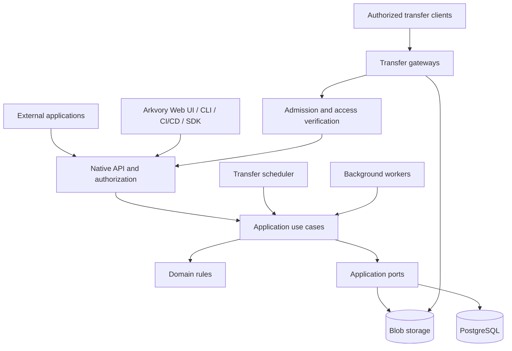

# ProAnima Arkvory


[English](README.md) | **Русский**

**Автономное хранилище и доставка пакетов, сборок и файлов.**

UPack-пакеты и обычные файлы, метаданные, метки, коллекции, очереди передач, удобный нативный API, SDK и CLI.

Проект **ProAnimaStudio**. Автор, правообладатель и владелец брендов Arkvory и ProAnimaStudio — **Ian Panaev**.

[Фирменные материалы](branding/README.md) · [Идентификаторы продукта](docs/PRODUCT_IDENTITY.md)

> **Стадия: standalone 0.2, разработка продолжается.** Работают native API, multipart/resume, каталог UPack/assets, метаданные, worker, очереди допуска, фоновая физическая очистка, offline repair/scrub, SDK и веб-консоль. Реализованы шлюзы чтения с арендой долей общего download-бюджета для общего хранилища. Репликация двух серверов ещё не готова.

Логическое удаление доступно через API, SDK и RU/EN консоль: отдельное право, проверка зависимостей и ревизии. Retention показывает кандидатов и обрабатывает только выбранные IDs; физическая очистка работает в фоне после настраиваемого grace period, без остановки загрузок и скачиваний. [Онлайн-очистка](docs/ONLINE_CLEANUP.md). [Контракт](docs/ARTIFACT_RETENTION.md).

## Назначение

ProAnima Arkvory проектируется как самостоятельный сервис, который хранит исходные артефакты, управляет их каталогом и надёжно доставляет их потребителям. Метаданные, версии, маркировка, права и история действий доступны через собственный интерфейс и API.

Сервис предназначен для инфраструктуры доставки приложений и контента: агентов развёртывания, CI/CD, каталогов артефактов, внутренних инструментов и других систем. Развёртывание и обновление Arkvory независимы от подключённых приложений.

Arkvory — самостоятельное хранилище артефактов с собственным удобным HTTP API, TypeScript SDK и CLI `arkvoryctl`; протоколы сторонних репозиториев не эмулируются. Внешние приложения подключаются к Arkvory по сети. Их остановка не должна влиять на прямую раздачу пакетов.

## Текущее состояние

API предоставляет каталог операций текущего ключа и шесть областей ответственности с отдельными уровнями видимости и представлениями OpenAPI. В SDK добавлены группы identity, administration и работа внутри репозитория; прежние методы сохранены. [Контракт интеграций](docs/API_SURFACES.md).

В RU/EN консоли доступны скачивание прямо из каталога, компактная мобильная навигация, действия очереди по её состоянию и сгруппированные формы управления доступом. [Поведение интерфейса и браузерная проверка](docs/CONSOLE_UX.md).

| Область                                                                                      | Состояние                                                                                                                                        |
| -------------------------------------------------------------------------------------------- | ------------------------------------------------------------------------------------------------------------------------------------------------ |
| TypeScript strict, чистые границы, runtime-сборка                                            | Реализовано                                                                                                                                      |
| Потоковая передача, SHA-256, GET/HEAD/Range/ETag                                             | Реализовано                                                                                                                                      |
| Адаптивные части 8 MiB–1 GiB, resume, TTL, идемпотентное завершение                          | Реализовано                                                                                                                                      |
| Ограниченные повторы SDK, проверяемая докачка, сохранённый prefix                            | Реализовано; [восстановление](docs/TRANSFER_RECOVERY.md)                                                                                         |
| Метаданные/метки/коллекции, CAS, поиск, аудит каталога                                       | Реализовано                                                                                                                                      |
| UPack manifest/group/SemVer, неизменяемые версии, asset revisions                            | Реализовано с ограничениями валидатора                                                                                                           |
| PostgreSQL completion jobs, lease/generation, retry, worker                                  | Реализовано                                                                                                                                      |
| Очереди upload/download с пределами и чередованием клиентов                                  | Один шлюз, in-memory                                                                                                                             |
| Шлюзы чтения и фиксированные доли общего download-бюджета                                    | Реализовано для общего storage, с PostgreSQL leases; без failover                                                                                |
| GC и scrub                                                                                   | Фоновая очистка; offline repair/scrub                                                                                                            |
| SDK и RU/EN веб-консоль                                                                      | Реализованы; подробности в runbook                                                                                                               |
| Внешний браузерный UI через Bearer API и список origins                                      | Реализовано для native API; [настройка](docs/EXTERNAL_UI.md)                                                                                     |
| История файлов, чтение ревизии, атомарное восстановление с аудитом                           | Реализованы API, SDK и консоль                                                                                                                   |
| Учётные записи и группы доступа к репозиториям                                               | Создание администратором, сессии и права групп                                                                                                   |
| Сортировка, группировка и страницы каталога пакетов                                          | API, SDK и консоль; до 100 версий на страницу                                                                                                    |
| Скачивание по идентичности пакета или пути файла                                             | Реализовано; те же ACL, Range и лимиты, что по ID                                                                                                |
| Импорт каталога с resume и download/hash проверкой                                           | Реализован; metadata и ACL переносятся отдельно                                                                                                  |
| JSON-журналы с уровнями, связка запрос→задача→аудит, метрики                                 | Реализовано; [runbook](docs/CORE_RUNBOOK.md), ADR 0052                                                                                           |
| Коды ошибок с причинами и полями; ID запроса в консоли и CLI                                 | Реализовано; [контракт ошибок](docs/API_CONTRACTS.md), ADR 0051                                                                                  |
| Встроенный HTTPS с перезагрузкой сертификата; reverse proxy остаётся                         | Реализовано; ADR 0055                                                                                                                            |
| Согласованная копия на диск/NAS, проверка, restore в пустую цель                             | CLI оператора, vault без шифрования; ADR 0054                                                                                                    |
| Копии по расписанию, retention, предупреждения, backup API/SDK/CLI                           | Агент, службы установщиков, API/SDK/CLI и раздел консоли (схема 26); ADR 0056, 0057                                                              |
| Зеркала репозиториев: забор по API, свой каталог и ключи, только чтение                      | Синхронизация в worker, API состояния, значок в консоли, `arkvory configure --mirror`; импорт dev→prod по стадии; ADR 0058                       |
| Подписанные релизы, одобряемые в хабе ProAnimaStudio; обратная связь со снимками и журналами | Поэтапная раскатка, GitHub при недоступности хаба, анонимная статистика (выключается); [хаб](docs/UPDATES.md#хаб-подпись-и-статистика), ADR 0060 |
| Локальный CI (Windows, Linux, systemd) и черновики релизов                                   | Реализовано; [локальный конвейер](docs/CI.md), ADR 0053                                                                                          |
| Два сервера с репликацией, failover и глобальная балансировка                                | Проектирование; стенд отложен                                                                                                                    |

Запуск: `npm run migrate`, `npm start`, отдельно `npm run worker`. Консоль: `/console/`. Запуск из исходников предназначен для разработки. Сервер ставится [установщиками](deploy/README.md) и вводится в эксплуатацию по [чек-листу Standalone](docs/PRODUCTION.md); Standalone — один сервер, не HA-система. См. [основной runbook](docs/CORE_RUNBOOK.md), [возможности 0.2](docs/LIFECYCLE_AND_CATALOG.md), [импорт и миграцию](docs/MIGRATION.md), [профиль двух серверов](docs/TWO_NODE_PLAN.md) и [проверки](docs/CORE_VALIDATION.md).

## Возможности и дальнейшее развитие

Standalone-шлюз поддерживает суммарные лимиты скорости upload/download, общую квоту клиента для всех его ключей и соединений, предел активных передач клиента и авторизованную диагностику readiness. Скорости настраиваются и по умолчанию не ограничены; стандартный допуск клиента — одна загрузка и до четырёх скачиваний. Бюджеты относятся к одному процессу. См. [управление трафиком](docs/TRAFFIC_CONTROL.md).

Дополнительный профиль общего хранилища допускает одного writer и шлюзы чтения. Фиксированные доли download-бюджета резервируются конечными PostgreSQL leases; потеря lease останавливает раздачу до перезапуска. Простаивающие доли не перераспределяются. См. [шлюзы чтения](docs/READ_GATEWAYS.md).

Консоль поддерживает светлую, тёмную и системную темы, переключение RU/EN без перезагрузки и адаптивные экраны каталога, загрузки, истории и свойств артефакта. Цвета, типографика, отступы, радиусы, элементы управления и анимация используют общие токены. Браузер сохраняет настройки оформления/языка и приватные download checkpoints с журналом восстановления; credentials остаются в памяти. См. [дизайн-систему](docs/DESIGN_SYSTEM.md) и [восстановление скачиваний и ограничения хранения](docs/DOWNLOAD_QUEUE.md).

UI на другом HTTPS origin может работать с native API по Bearer-токену при явном разрешении origin на сервере. Встроенная консоль также принимает адрес API из конфигурации страницы. См. [руководство по внешнему UI](docs/EXTERNAL_UI.md).

Администратор создаёт учётные записи и группы доступа к репозиториям. Пользователь входит с 12-часовой сессией и может сменить свой пароль; консоль хранит токен только в текущей вкладке и предлагает доступные репозитории после входа. Персональные токены создаются только из сессии, действуют не дольше 365 дней (по умолчанию 90), имеют доступ `read` или `read-write`, никогда не получают прав администратора и отзываются любой сменой пароля. Вход и необязательная самостоятельная регистрация ограничены по клиенту, вместо блокировки действует ограниченный backoff учётной записи, а изменения identity пишутся в append-only журнал безопасности. См. [учётные записи и токены](docs/IDENTITY.md). Экран пакетов сортирует по группе, имени и SemVer-версии и группирует по UPack group или пакету. См. [runbook](docs/CORE_RUNBOOK.md).

### Пакеты, файлы и каталог

- UPack-репозитории: группы, имена, версии и исходные архивы без перепаковки при импорте.
- Обычные файлы: дерево путей, неизменяемые ревизии и атомарная смена текущей версии файла.
- Плоские строковые метаданные: описание, владелец, платформа, архитектура, build/commit и пользовательские поля. Проверка по схемам запланирована.
- Метки, логические коллекции, фильтры и поиск с учётом прав доступа. Согласование выпуска и процессы смены статусов запланированы.
- Раздельное хранение исходных полей UPack и редактируемых свойств каталога.
- История изменений и внешние ссылки: компонент, используемый продуктом, защищён от автоматической очистки.

### Приём и доставка

- Потоковые загрузки и скачивания с backpressure, отменой и ограниченными буферами.
- Устойчивые сессии загрузки частями с проверкой размера, покрытия и SHA-256.
- GET/HEAD, ETag, Range/If-Range и продолжение скачивания поддерживающим это клиентом.
- Незавершённые или непроверенные файлы не появляются как опубликованные.
- Раздача конкретного неизменяемого содержимого, даже если логический путь файла уже обновлён.

### Очереди и сеть

- Отдельные очереди загрузок, скачиваний и фоновых задач.
- Ротация клиентов и ограниченное ожидание допуска; серверные приоритеты и гарантии отсутствия голодания при смешанной нагрузке остаются в плане.
- Лимиты параллельных передач, полосы, временного дискового пространства и квот репозиториев.
- Несколько шлюзов с распределением допусков и сетевых бюджетов.
- Запланировано: согласованные бюджеты миграции и репликации, сохраняющие ресурсы рабочей раздачи.

### Безопасность и эксплуатация

- Сервисные аккаунты, права на репозитории и отдельные операции, ротация ключей и аудит.
- Одна схема аутентификации для сервисных ключей и пользовательских сессий: `Authorization: Bearer`.
- Запланировано: короткоживущие токены передачи, ограниченные объектом и действием; сейчас скачивание использует обычную авторизацию API.
- Проверки архивов, безопасные пути и ограничения размера метаданных.
- Восстановление промежуточных операций, идемпотентное завершение и контроль целостности.
- Health/readiness и диагностика передач реализованы. Ручная согласованная копия БД и blobs во встроенный vault, её проверка и восстановление в пустую цель выполняются CLI оператора `npm run backup` (ADR 0054). Агент под службой ОС `npm run backup -- agent` добавляет ежедневное расписание в явном часовом поясе, retention с очисткой vault, проверки, предупреждения и метрики; API `/api/v1/backup`, SDK `client.backup` и `arkvoryctl backup` ставят задания и показывают состояние (ADR 0056); раздел консоли «Резервные копии» показывает состояние и предупреждения, запускает копию и полную проверку, закрепляет точки, применяет хранение после предпросмотра и меняет план, а восстановление остаётся командой оператора ([поведение консоли](docs/CONSOLE_UX.md#резервные-копии)). Установщики запускают агента службой рядом с API и worker; `arkvory configure --backup-vault <dir> --init-vault` проверяет каталог vault, выдаёт доступ учётной записи службы, перезапускает агента и откатывает настройку, если агент не сообщил этот vault (ADR 0057). Шифрование, S3 и мастер восстановления остаются [в плане](docs/BACKUP_RECOVERY.md).

## Архитектура



Схема показывает взаимодействие компонентов. Направление зависимостей исходного кода задаётся отдельно в [архитектуре](docs/ARCHITECTURE.md): домен независим от инфраструктуры, application определяет порты, адаптеры реализуют их, приложения собирают зависимости.

Большие файлы передаются напрямую через файловые шлюзы и не должны накапливаться целиком в памяти API. Один проект содержит несколько запускаемых ролей; каждый TypeScript-пакет не требует отдельного сервера.

### Технологическое направление

| Слой                           | Решение                                                                     |
| ------------------------------ | --------------------------------------------------------------------------- |
| Язык                           | TypeScript с `strict`, дополнительными проверками индексов и optional-полей |
| Runtime                        | Node.js 24 LTS, ESM                                                         |
| Организация кода               | npm workspaces; domain, application, adapters и composition roots           |
| HTTP API                       | Fastify, реализован нативный API                                            |
| Метаданные и устойчивые задачи | PostgreSQL, каталог и миграции реализованы                                  |
| Содержимое                     | Local backend реализован; S3 и HA backend запланированы                     |
| Файловые шлюзы                 | Node.js-шлюз реализован; отдельная интеграция раздачи через Nginx в плане   |
| UI                             | TypeScript; framework ещё не выбран                                         |
| Качество                       | TypeScript, ESLint, Prettier, dependency-cruiser, GitHub Actions            |

Версии dev-инструментов зафиксированы в manifests и lock-файле. Runtime-зависимости вводятся вместе с реальными сценариями.

## API и интеграции

[Карта API](docs/API_MAP.md) описывает текущие маршруты, права и ограничения. [Управляемые сервисные ключи](docs/SERVICE_KEYS.md) уже поддерживают точные права на репозитории, однократную выдачу, активацию, ротацию, срок и отзыв, проверки API/worker/reader и SDK. В более широкой [модели доступа](docs/API_ACCESS.md) и [плане развития](docs/API_EVOLUTION.md) рекурсивные роли, импорт legacy identities, namespace selectors и масштабирование интеграций остаются будущими этапами. Инженерная документация ведётся на русском.

Делегированное управление реализовано для точных целевых аккаунтов: bootstrap назначает managed ключу оператора семь отдельных административных действий и предел прав репозиториев. Оператор не управляет собой и не делегирует дальше; ротация не переносит grants. Pending keys повторно проверяют issuer при активации, уже активированные ключи потребителей требуют явного отзыва. Доступны API/SDK и [веб-администрирование](docs/WEB_ADMINISTRATION.md): аккаунты, политики, ключи, делегирование и аудит. См. [контракт и порядок обновления](docs/SERVICE_DELEGATION.md).

Большие файловые каталоги можно обходить через новый API `assets/page` и SDK: ограниченные страницы, буквальный префикс, проверка прав на каждом запросе и поиск по индексу. Прежний список assets сохраняет совместимость. См. [пагинацию файлов и схему 11](docs/ASSET_PAGINATION.md).

Discovery репозиториев показывает только доступные клиенту логические области, включая пустые: постраничный список и карточки с форматами и эффективными правами. Managed-ключу явно назначается `repository.read`; содержимое и администрирование требуют отдельных прав. Доступны API и SDK. [Контракт](docs/REPOSITORY_DISCOVERY.md).

Нативный API `/api/v1` реализует multipart uploads, задания сборки, раздачу файлов, редактируемые annotations, каталог пакетов/assets, историю и восстановление файлов, внешние ссылки и аудит каталога. OpenAPI доступна по `/api/v1/openapi.json`. Управление пользователями и группами реализовано; распределённые передачи, события/webhooks и расширенное управление сервисами ещё запланированы. Проверки ответов во время выполнения, OpenAPI и TypeScript SDK поддерживаются согласованно. Сборка также сохраняет `packages/contracts/dist/openapi.json`. Все HTTP-операции, включая HEAD, имеют стабильные operationId и явное описание прав/retry; маршруты сверяются при startup и в CI. [Правила контракта](docs/API_CONTRACT_GUARD.md).

Содержимое можно скачать по ID артефакта или по имени:

| Маршрут внутри `/api/v1/repositories/{repository}` | Результат                                                |
| -------------------------------------------------- | -------------------------------------------------------- |
| `GET/HEAD artifacts/{id}/content`                  | Неизменяемые байты одного артефакта                      |
| `GET/HEAD packages/content?group=&name=&version=`  | Исходный архив UPack точной версии                       |
| `GET/HEAD packages/content?group=&name=`           | Старшая стабильная SemVer; диапазон и стадия — PROMOTION |
| `GET/HEAD asset/content?path=`                     | Текущая ревизия файла по пути                            |

Маршруты по имени разрешают цель на каждом запросе и далее соблюдают те же ACL (`content.read`), допуск, полосу и Range/ETag/If-Range, что скачивание по ID. Для докачки передавайте `If-Range` с полученным ETag или закрепляйте ID артефакта. Протоколы сторонних репозиториев не эмулируются; см. [ADR 0045](docs/adr/0045-native-only-api.md).

Нативный клиент сможет получать задания очереди, ожидать допуск и продолжать передачу. Синхронные маршруты скачивания по-прежнему возвращают байты файла, а не `202 + JSON`.

Внешние приложения используют публичное API и portable TypeScript SDK в этом workspace. Общая БД и прямые импорты внутреннего кода Arkvory не требуются. Webhooks проектируются с подписями, повторной доставкой и дедупликацией.

## Надёжность и масштабирование

Исходный сценарий проектирования — около **4 ТБ данных** и объекты размером **десятки гигабайт и больше**. Фиксированного предела размера нет: multipart-раскладка адресует до 10 000 частей по 1 GiB (около 10 TiB), оператор может задать меньший `ARKVORY_MAX_OBJECT_BYTES`; фактические границы — квоты и свободное место. Потоковая передача и multipart upload не зависят по памяти от размера объекта. Одиночная передача 5 GiB и перезапуск проверены локально; см. отчёт об испытаниях. Число клиентов, сеть, оборудование и RPO/RTO ещё уточняются.

- **Standalone:** одна машина, local backend и backup; не гарантирует доступность при потере машины.
- **HA на площадке:** несколько API/шлюзов, доступный входной адрес, HA PostgreSQL и отказоустойчивое содержимое с согласованной политикой подтверждения записи.
- **Несколько площадок:** отдельный будущий профиль локальной доставки, кешей и межплощадочной репликации.

Балансировка запросов не заменяет резервирование данных. Репликация не заменяет backup. При падении шлюза уже открытое TCP-соединение обрывается; возобновление требует поддержки клиента. Заявлять гарантии доступности будем после испытаний выбранной топологии.

Для независимой репликации подготовлены два отдельных проектных профиля: переносимые асинхронные зеркала и синхронный HA на выбранной инфраструктуре. Описаны подтверждение копий, защита от GC, административный API и UI; runtime репликации и переключение writer пока не реализованы. [Протокол и этапы](docs/REPLICATION.md), [API управления](docs/REPLICATION_API.md), [UI/UX](docs/REPLICATION_UX.md).

## Структура репозитория

```text
apps/
  api/              HTTP API и сборка зависимостей
  worker/           фоновые обработчики
  scheduler/        процесс планирования передач
  web/              автономный интерфейс Arkvory
packages/
  domain/           чистые предметные правила и состояния
  application/      сценарии и порты внешних зависимостей
  contracts/        публичные схемы API и событий
  infrastructure/   адаптеры БД, хранилища и внешних систем
  sdk/              публичный HTTP-клиент
docs/
  adr/              архитектурные решения
  templates/        шаблоны описания изменений
deploy/             будущие профили развёртывания
tests/              unit, integration и испытания больших передач
scripts/            средства проверки проекта
.github/workflows/  проверки каркаса в GitHub Actions
```

## Подготовка окружения

Для разработчиков с предоставленными правами по проприетарной лицензии. Нужны Node.js 24 LTS, npm 11, PostgreSQL 18 и локальная файловая система с hard links. Docker необязателен, если PostgreSQL уже доступна.

```sh
git clone https://github.com/ProAnima/Arkvory.git
cd Arkvory
npm ci
npm run build
npm run init:local
docker compose --env-file .env -f deploy/compose.dev.yml up -d --wait
npm run migrate
npm start
```

Инициализация создаёт случайные ключи в исключённых из Git `data/` и `.env`, не перезаписывая существующую конфигурацию. API слушает `127.0.0.1:8080`. Из другого терминала: `npm run upload -- ./example.upack releases`. CLI напечатает URL артефакта; для запросов нужен созданный Bearer key.

Для своей БД задайте `ARKVORY_DATABASE_URL` в `.env` вместо запуска Compose. Конфигурация, права, восстановление и сетевое подключение с TLS описаны в [runbook](docs/CORE_RUNBOOK.md).

| Команда                    | Назначение                                           |
| -------------------------- | ---------------------------------------------------- |
| `npm run check`            | Формат, типы, ESLint, архитектурные границы          |
| `npm run build`            | Сборка всех workspaces в JavaScript и declarations   |
| `npm test`                 | Сборка и тесты домена, Range и локального хранилища  |
| `npm run test:integration` | PostgreSQL и HTTP; нужен `ARKVORY_TEST_DATABASE_URL` |
| `npm run test:large`       | 5 GiB через HTTP, перезапуск, проверка хеша и RSS    |
| `npm run format`           | Применение форматирования                            |

Multipart upload продолжается с подтверждённых частей (размер части фиксируется сессией; клиенты для файлов больше 16 GiB завершают загрузку через worker); whole-file PUT повторяется с байта 0. Фоновая очистка освобождает резерв отменённых сессий после grace period и удаления их содержимого. На одну standalone-БД допускается один API; failover узла отсутствует. Резервируйте и восстанавливайте БД вместе со всем каталогом содержимого, включая `storage-id`. Перед обновлением остановите API/worker, сделайте backup обеих частей, выполните `npm run migrate` (схема 26), затем запустите новый код. См. [историю и восстановление файлов](docs/LIFECYCLE_AND_CATALOG.md#история-и-восстановление-файлов) и [онлайн-индексы каталога](docs/adr/0014-online-package-page-indexes.md).

## Правила разработки

Основные инструкции находятся в [AGENTS.md](AGENTS.md) и [CONTRIBUTING.md](CONTRIBUTING.md).

- Предметные правила не зависят от HTTP, БД, Node globals или UI.
- Интерфейсы внешних зависимостей принадлежат application; реализации находятся в adapters.
- Межпакетные импорты используют публичные exports вида `@proanima/arkvory-domain`.
- Внешние данные проверяются во время выполнения; `as` не заменяет валидацию.
- Не ослабляем strict и не используем `any` для обхода ошибок.
- Предпочитаем композицию и небольшие сценарии; абстракции добавляются под реальную потребность.
- Для передач обязательны ограниченные буферы, отмена, идемпотентность и обработка частичного отказа.
- Изменения важных контрактов, долговечности и границ фиксируются в ADR.

Первые рабочие сценарии покрыты Node.js test runner. Одни статические проверки не подтверждают долговечность и доступность хранилища.

## Порядок реализации

1. Инвентаризация потребителей и сценариев, определение обязательных контрактов и инфраструктуры.
2. Сквозная передача: публикация, хранение, проверка и скачивание 5 ГБ, перезапуск и Range.
3. Каталог, metadata, labels/collections, ревизии, права, аудит и UI.
4. Устойчивые очереди, квоты, fairness и несколько шлюзов.
5. Нативный API, SDK, CLI и сетевые интеграции внешних клиентов.
6. Испытания HA, backup/restore и отказных режимов.
7. Возобновляемая миграция, пилот, финальная синхронизация, переключение и откат.

Полные критерии этапов: [ROADMAP](docs/ROADMAP.md). Первый standalone-сценарий передачи реализован; раздача с реплицируемых копий остаётся отдельным этапом. Шлюзы чтения, фиксированные общие квоты и порядок обновления описаны в [READ_GATEWAYS](docs/READ_GATEWAYS.md). Перед обслуживанием или изменением общей policy остановите все readers, writer и worker.

## Документация

Английский и русский README описывают одинаковый объём продукта. Подробная инженерная документация пока ведётся на русском; проприетарная лицензия и уведомление об авторстве — на английском.

| Документ                                     | Содержание                                                                              |
| -------------------------------------------- | --------------------------------------------------------------------------------------- |
| [PRODUCTION](docs/PRODUCTION.md)             | Чек-лист вывода Standalone в эксплуатацию: HTTPS, доступ, копии, мониторинг, обновления |
| [SECOND_SITE](docs/SECOND_SITE.md)           | Вторая площадка: зеркала всех репозиториев, мониторинг и ручной переход                 |
| [CORE_RUNBOOK](docs/CORE_RUNBOOK.md)         | Запуск ядра, API, конфигурация и восстановление                                         |
| [CORE_VALIDATION](docs/CORE_VALIDATION.md)   | Результаты испытаний standalone и ограничения                                           |
| [PROJECT_PLAN](docs/PROJECT_PLAN.md)         | Подробный продуктовый и технический план                                                |
| [ARCHITECTURE](docs/ARCHITECTURE.md)         | Слои и разрешённые зависимости                                                          |
| [DOMAIN_MODEL](docs/DOMAIN_MODEL.md)         | Предметные сущности и инварианты                                                        |
| [API_CONTRACTS](docs/API_CONTRACTS.md)       | Нативный API, SDK и контракты скачивания                                                |
| [RELIABILITY](docs/RELIABILITY.md)           | Запись, очереди, сеть, деградация и восстановление                                      |
| [TESTING](docs/TESTING.md)                   | Стратегия функциональных и отказных испытаний                                           |
| [CI](docs/CI.md)                             | Действующие проверки GitHub Actions                                                     |
| [BOOTSTRAP_CHECKS](docs/BOOTSTRAP_CHECKS.md) | Что проверено в исходном каркасе                                                        |
| [ROADMAP](docs/ROADMAP.md)                   | Этапы и открытые решения                                                                |
| [ADR](docs/adr/README.md)                    | История архитектурных решений                                                           |
| [SECURITY](SECURITY.md)                      | Требования безопасности                                                                 |
| [LICENSING](docs/LICENSING.md)               | Правообладатель и модель разрешений партнёрам                                           |

## Лицензия и авторство

**Copyright © 2026 Ian Panaev. All rights reserved.**

ProAnima Arkvory — проприетарный проект. Ian Panaev является автором, правообладателем и владельцем бренда ProAnimaStudio. Права на использование, изменение, распространение и создание приватных форков предоставляются определённым компаниям только отдельными письменными соглашениями с правообладателем, с учётом применимого закона и иных уже предоставленных прав.

Наличие доступа к репозиторию не заменяет такое соглашение. Объём разрешений, права на доработки, распространение сборок и использование бренда определяются отдельно. Исходный код не публикуется под MIT, Apache, GPL или другой открытой лицензией.

Полные условия репозитория: [LICENSE.md](LICENSE.md). Уведомление об авторстве: [NOTICE.md](NOTICE.md). Сторонние компоненты сохраняют собственные лицензии.

В SDK и консоли добавлена ограниченная очередь скачиваний: пауза/докачка из временной копии на диске, отмена, очистка ожидающих, настройка параллелизма и задержки запуска. Итоговый файл сохраняется после проверки хеша. OPFS-журнал и сегменты по 8 МиБ позволяют восстановить очередь после перезагрузки: подключитесь, восстановите задания и выберите файлы назначения. Ключи и handles назначения не сохраняются. Это не распределённая серверная очередь. [Управление скачиваниями](docs/DOWNLOAD_QUEUE.md).

### Продвижение и разрешение версий

Сборка переходит от CI к production двумя совместимыми способами. **Стадии** — управляемые метки (`qa`, `release`, `prod`; до 16 на артефакт), которые меняются только через promotion API с правом `artifact.promote`; каждое изменение попадает в журнал с автором, временем и комментарием, а артефакты со стадией защищены от retention. **Перенос между репозиториями** публикует артефакт в другом репозитории (`dev` → `staging` → `prod`) без повторной передачи байтов: `copy` оставляет источник, `move` выводит его в той же транзакции. Повторный promote возвращает уже созданную копию.

Агент развёртывания запрашивает версию, а не ID: `packages/resolve` и `packages/content` принимают точную версию или SemVer-диапазон (`^1.4`, `>=1.0.0 <2.0.0`), стадию, явное включение prerelease и `order=promoted` («последняя продвинутая»), поэтому откат сводится к изменению стадии. Ключу только с `content.read` достаточно для скачивания выбранной версии. Доступно в API, SDK (`client.promotions`, `inRepository(...).stages/promotions/packages.resolve`) и CLI (`arkvoryctl promote`, `stages`, `packages resolve|download`, `promotions journal`); консоль показывает стадии, историю и форму продвижения в карточке артефакта и стадии в списке пакетов. Схема 22. [Руководство](docs/PROMOTION.md), [ADR 0047](docs/adr/0047-artifact-promotion.md).

### Метаданные и вложения сборок

Опубликованные артефакты поддерживают редактируемые метки, текстовые метаданные и коллекции, а также ревизионные привязки манифестов, SBOM, подписей, отчётов и дополнительных файлов того же репозитория. В консоли доступны поля метаданных, подсказки меток, загрузка вложения с продолжением и история/восстановление. Конкурирующие правки защищены ревизиями; снятие привязки сохраняет исходные файлы. API относится к каталогу, использует общую авторизацию репозитория и SDK. Требуется миграция БД 12. [Контракт, ограничения и примеры](docs/BUILD_DETAILS.md).

### Политики хранения и диагностика

Автоочистка сохраняет последние N зарегистрированных UPack-билдов по пакету/каналу, пакету или всему репозиторию. Защищённые метки, внешние ссылки и история сохраняют нужные версии сверх N. Квоты учитывают незавершённые загрузки и удалённые данные до физического GC. API, SDK и RU/EN-консоль предоставляют настройки с ревизиями, предпросмотр, статистику места и ограниченный журнал предупреждений/ошибок. Новые managed-права: `storage.read`, `storage.manage`, `diagnostics.read`; включение требует также `artifact.delete`. Расписание повторно проверяет ключ, которым включили политику. По умолчанию очистка выключена. Требуется миграция 15. Физическая очистка имеет отдельные настройки с ревизиями: grace, размер порции, интервал, задержка и пауза на работающем сервисе. Активные передачи и связанные файлы защищены; квота освобождается после успешного удаления. По умолчанию выключена; требуется обновить все процессы до схемы 17. [Онлайн-очистка](docs/ONLINE_CLEANUP.md). [Контракт и эксплуатация](docs/STORAGE_POLICIES.md).

`npm run upack:manifest -- --input manifest.json --metadata custom.json --output upack.json` подготавливает внутренние custom-метаданные UPack перед упаковкой, сохраняя вложенные `_`-поля без изменения опубликованных архивов.

### Инженерные гейты

`npm run gate -- quick` проверяет архитектуру, форматирование, строгие типы, lint, сборку и unit-тесты. `verify` дополнительно требует PostgreSQL, браузерную приёмку и аудит зависимостей; `release` добавляет оба настоящих сценария передачи 5 GiB с отказами и восстановлением. CI выполняет quality на Windows/Linux и обязательные задания БД/браузера/безопасности. Лимиты: 500 строк кода на файл, 300 на класс и 100 на функцию; существующие исключения явные, заморожены и ограничены сроком. [Настройка, расширение и отчёты](docs/ENGINEERING_GATES.md), [аудит архитектуры](docs/ARCHITECTURE_AUDIT_2026-09-25.md).

### Установка и стабильные обновления

Консоль администратора уведомляет о новых стабильных релизах и позволяет запустить установку с подтверждением, включить автообновление и выбрать час обслуживания UTC. Проверки релизов продолжаются при выключенной автоустановке. Ограниченные запросы выполняет отдельный планировщик хоста; API не получает shell-доступ или GitHub credential. [Управление, API и восстановление](docs/UPDATES.md).

Нативные установщики: **Arkvory-Setup-x64.exe** (мастер RU/EN, включённые Node.js/PostgreSQL/WinSW/VC++ runtime, владелец и onboarding), **Arkvory-amd64.deb** и **Arkvory-x86_64.rpm** (Node.js внутри; зависимости базы разрешает пакетный менеджер). Windows устанавливается офлайн. Для пакетов и удаления с сохранением данных есть отдельные CI-гейты. Приёмка конкретных RPM-дистрибутивов и подпись издателя остаются условиями выпуска. В консоли — знакомство, каталог API с учётом прав и справка CLI.

Обновления берутся из GitHub Releases по решению хаба ProAnimaStudio (каналы, поэтапная раскатка; при недоступности хаба — напрямую с GitHub), каждый релиз подписан ключом студии и проверяется перед установкой; есть отключаемая автоматика, pin и откат. Релиз со сменой схемы БД ставится так же, но только после свежей копии, снятой и проверенной встроенным агентом; при неудачной миграции возвращается прежняя версия. Данные и настройки отделены от кода; у базы отдельная служба. Смена major PostgreSQL и обслуживание установленного runtime выполняются отдельно. Операторские скрипты/Compose сохранены; CMD-launchers удалены. [Установка и требования платформ](deploy/README.md).

### Удалённый CLI

**Arkvory Remote Setup** включён в клиентские установщики. Мастер RU/EN в браузере проверяет SSH-сервер, устанавливает стабильный нативный релиз с зависимостями и службами, создаёт владельца, проверяет готовность и пробрасывает консоль на локальный адрес. К существующей установке можно подключиться без переустановки. Этот профиль предоставляет приватный SSH-доступ с компьютера администратора; постоянная LAN/HTTPS-публикация и удалённый Compose в мастере пока не реализованы. [Удалённая установка и требования](docs/REMOTE_DEPLOYMENT.md).

`arkvoryctl` — отдельный удалённый клиент: профили серверов, продолжение загрузки/скачивания с проверкой SHA-256, метаданные и метки, вложения с ревизиями, публикация UPack командой `packages publish`, поиск по значениям метаданных, статистика хранения и каталог API. `--json` предназначен для CI/CD; справка доступна на русском и английском. Ключи поступают из окружения или приватных файлов, не из аргументов команды. Клиентские Windows EXE для текущего пользователя и Linux DEB/RPM включают Node.js без установки служб сервера и PostgreSQL. Отдельный `arkvoryctl.mjs` работает в CI с Node.js 24. [Установка, примеры, восстановление и справка команд](docs/CLI.md).

Удобство: очередь скачиваний восстанавливается после перезагрузки страницы через OPFS-журнал и сегменты по 8 МиБ. Подключитесь, восстановите очередь и заново выберите файлы назначения; ключи не сохраняются. Поиск работает по значениям метаданных и точным парам ключ/значение. `arkvoryctl packages publish FILE` объединяет upload и регистрацию UPack, сохраняя безопасный повтор после обрыва. [Очередь](docs/DOWNLOAD_QUEUE.md), [CLI и поиск](docs/CLI.md).

Все runtime-роли подтверждают владение хранилищем через то же соединение PostgreSQL каждые две секунды; утраченное владение не восстанавливается без перезапуска. Это не межсерверный fencing и не репликация. [Гарантии владения](docs/adr/0042-bounded-storage-ownership.md).

Объектные PostgreSQL-сессии и completion jobs получили ограниченное подтверждение владения и проверки разрывов связи/восстановления worker. Репликация и межсерверное переключение ещё не реализованы; см. [аудит кластерной готовности](docs/CLUSTER_AUDIT_2026-09-26.md).
