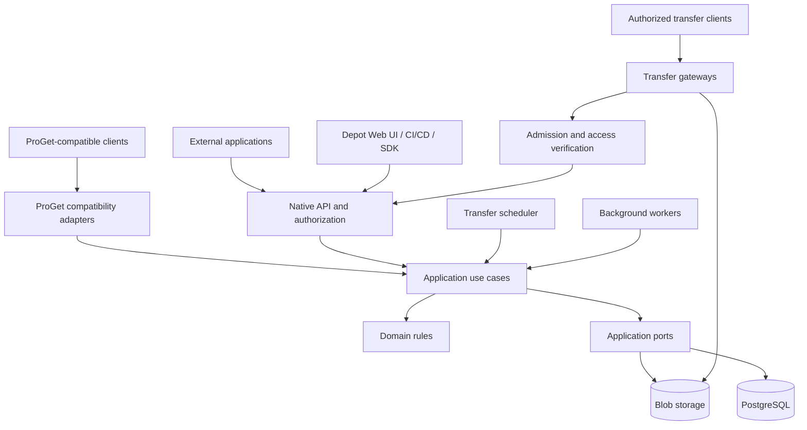

# ProAnima Depot

[English](README.md) | **Русский**

**Автономное хранилище и доставка пакетов, сборок и файлов.**

Проект **ProAnimaStudio**. Автор, правообладатель и владелец бренда ProAnimaStudio — **Ian Panaev**.

> **Стадия: standalone 0.2, разработка продолжается.** Работают native API, multipart/resume, каталог UPack/assets, метаданные, worker, очереди допуска, offline GC/scrub, SDK и веб-консоль. Legacy download поддерживается частично. Реализованы шлюзы чтения с арендой долей общего download-бюджета для общего хранилища. Репликация двух серверов и полная замена ProGet ещё не готовы.

## Назначение

ProAnima Depot проектируется как самостоятельный сервис, который хранит исходные артефакты, управляет их каталогом и надёжно доставляет их потребителям. Метаданные, версии, маркировка, права и история действий доступны через собственный интерфейс и API.

Сервис предназначен для инфраструктуры доставки приложений и контента: агентов развёртывания, CI/CD, каталогов артефактов, внутренних инструментов и других систем. Развёртывание и обновление Depot независимы от подключённых приложений.

Один из первых сценариев — замена ProGet для Universal Packages и обычных файлов с сохранением используемых клиентами HTTP-контрактов. Внешние приложения подключаются к Depot по сети. Их остановка не должна влиять на прямую раздачу пакетов.

## Текущее состояние

| Область                                                            | Состояние                                                         |
| ------------------------------------------------------------------ | ----------------------------------------------------------------- |
| TypeScript strict, чистые границы, runtime-сборка                  | Реализовано                                                       |
| Потоковая передача, SHA-256, GET/HEAD/Range/ETag                   | Реализовано                                                       |
| Части 8 MiB, resume, TTL, идемпотентное завершение                 | Реализовано                                                       |
| Ограниченные повторы SDK, проверяемая докачка, сохранённый prefix  | Реализовано; [восстановление](docs/TRANSFER_RECOVERY.md)          |
| Метаданные/метки/коллекции, CAS, поиск, аудит каталога             | Реализовано                                                       |
| UPack manifest/group/SemVer, неизменяемые версии, asset revisions  | Реализовано с ограничениями валидатора                            |
| PostgreSQL completion jobs, lease/generation, retry, worker        | Реализовано                                                       |
| Очереди upload/download с пределами и чередованием клиентов        | Один шлюз, in-memory                                              |
| Шлюзы чтения и фиксированные доли общего download-бюджета          | Реализовано для общего storage, с PostgreSQL leases; без failover |
| GC и scrub                                                         | Offline; опубликованные blobs не удаляются                        |
| SDK и RU/EN веб-консоль                                            | Реализованы; подробности в runbook                                |
| История файлов, чтение ревизии, атомарное восстановление с аудитом | Реализованы API, SDK и консоль                                    |
| Учётные записи и группы доступа к репозиториям                     | Создание администратором, сессии и права групп                    |
| Сортировка, группировка и страницы каталога пакетов                | API, SDK и консоль; до 100 версий на страницу                     |
| Legacy UPack/assets download                                       | Поднабор; реальный ProGet ещё не проверен                         |
| Импорт каталога с resume и download/hash проверкой                 | Реализован; экспорт ProGet и ACL отдельно                         |
| Два сервера с репликацией, failover и глобальная балансировка      | Проектирование; стенд отложен                                     |

Запуск: `npm run migrate`, `npm start`, отдельно `npm run worker`. Консоль: `/console/`. Это выпуск для разработки, не промышленная HA-система. См. [основной runbook](docs/CORE_RUNBOOK.md), [возможности 0.2](docs/LIFECYCLE_AND_CATALOG.md), [границы ProGet API](docs/COMPATIBILITY.md), [миграцию](docs/MIGRATION.md), [профиль двух серверов](docs/TWO_NODE_PLAN.md) и [проверки](docs/CORE_VALIDATION.md).

## Возможности и дальнейшее развитие

Standalone-шлюз поддерживает суммарные лимиты скорости upload/download, общую квоту клиента для всех его ключей и соединений, предел активных передач клиента и авторизованную диагностику readiness. Скорости настраиваются и по умолчанию не ограничены; стандартный допуск клиента — одна загрузка и до четырёх скачиваний. Бюджеты относятся к одному процессу. См. [управление трафиком](docs/TRAFFIC_CONTROL.md).

Дополнительный профиль общего хранилища допускает одного writer и шлюзы чтения. Фиксированные доли download-бюджета резервируются конечными PostgreSQL leases; потеря lease останавливает раздачу до перезапуска. Простаивающие доли не перераспределяются. См. [шлюзы чтения](docs/READ_GATEWAYS.md).

Консоль поддерживает светлую, тёмную и системную темы, переключение RU/EN без перезагрузки и адаптивные экраны каталога, загрузки, истории и свойств артефакта. Цвета, типографика, отступы, радиусы, элементы управления и анимация используют общие токены. В браузере сохраняются только настройки оформления и языка. См. [дизайн-систему](docs/DESIGN_SYSTEM.md).

Администратор создаёт учётные записи и группы доступа к репозиториям. Пользователь входит с 12-часовой сессией и может сменить свой пароль; консоль хранит токен только в текущей вкладке. Экран пакетов сортирует по группе, имени и SemVer-версии и группирует по UPack group или пакету. См. [runbook](docs/CORE_RUNBOOK.md).

### Пакеты, файлы и каталог

- UPack-репозитории: группы, имена, версии и исходные архивы без перепаковки при импорте.
- Обычные файлы: дерево путей, неизменяемые ревизии и атомарная смена текущей версии файла.
- Метаданные со схемами: описание, владелец, платформа, архитектура, build/commit и пользовательские поля.
- Метки, статусы выпуска, логические коллекции, фильтры и поиск с учётом прав доступа.
- Раздельное хранение исходных полей UPack и редактируемых свойств каталога.
- История изменений и внешние ссылки: компонент, используемый продуктом, защищён от автоматической очистки.

### Приём и доставка

- Потоковые загрузки и скачивания с backpressure, отменой и ограниченными буферами.
- Устойчивые сессии загрузки частями с проверкой размера, покрытия и SHA-256.
- GET/HEAD, ETag, Range/If-Range и продолжение скачивания поддерживающим это клиентом.
- Незавершённые или непроверенные файлы не появляются как опубликованные.
- Раздача конкретного неизменяемого содержимого, даже если логический путь файла уже обновлён.

### Очереди и сеть

- Отдельные очереди загрузок, скачиваний и фоновых задач.
- Приоритеты, справедливое распределение между клиентами и защита от бесконечного ожидания.
- Лимиты параллельных передач, полосы, временного дискового пространства и квот репозиториев.
- Несколько шлюзов с распределением допусков и сетевых бюджетов.
- Ограничение фоновой миграции и репликации, чтобы они не вытесняли рабочие установки.

### Безопасность и эксплуатация

- Сервисные аккаунты, права на репозитории и отдельные операции, ротация ключей и аудит.
- Короткоживущие токены передачи, ограниченные объектом и действием.
- Проверки архивов, безопасные пути и ограничения размера метаданных.
- Восстановление промежуточных операций, идемпотентное завершение и контроль целостности.
- Метрики, health/readiness, резервные копии и проверяемое восстановление.

## Архитектура



Схема показывает взаимодействие компонентов. Направление зависимостей исходного кода задаётся отдельно в [архитектуре](docs/ARCHITECTURE.md): домен независим от инфраструктуры, application определяет порты, адаптеры реализуют их, приложения собирают зависимости.

Большие файлы передаются напрямую через файловые шлюзы и не должны накапливаться целиком в памяти API. Один проект содержит несколько запускаемых ролей; каждый TypeScript-пакет не требует отдельного сервера.

### Технологическое направление

| Слой                           | Решение                                                                     |
| ------------------------------ | --------------------------------------------------------------------------- |
| Язык                           | TypeScript с `strict`, дополнительными проверками индексов и optional-полей |
| Runtime                        | Node.js 24 LTS, ESM                                                         |
| Организация кода               | npm workspaces; domain, application, adapters и composition roots           |
| HTTP API                       | Fastify, реализован нативный API                                            |
| Метаданные и устойчивые задачи | PostgreSQL, каталог и миграции реализованы                                  |
| Содержимое                     | Local backend реализован; S3 и HA backend запланированы                     |
| Файловые шлюзы                 | Nginx и проверяемое управление допусками/полосой                            |
| UI                             | TypeScript; framework ещё не выбран                                         |
| Качество                       | TypeScript, ESLint, Prettier, dependency-cruiser, GitHub Actions            |

Версии dev-инструментов зафиксированы в manifests и lock-файле. Runtime-зависимости вводятся вместе с реальными сценариями.

## Совместимость и интеграции

Нативный API `/api/v1` реализует multipart uploads, задания сборки, раздачу файлов, редактируемые annotations, каталог пакетов/assets, историю и восстановление файлов, внешние ссылки и аудит каталога. OpenAPI доступна по `/api/v1/openapi.json`. Распределённые передачи, события/webhooks и администрирование ещё запланированы. Проверки ответов во время выполнения, OpenAPI и TypeScript SDK поддерживаются согласованно.

Планируемые адаптеры ProGet покроют используемые операции трёх семейств:

| Семейство                    | Назначение                                    |
| ---------------------------- | --------------------------------------------- |
| `/api/packages/{feed}/...`   | Общие операции с пакетами                     |
| `/upack/{feed}/...`          | Universal Feed API                            |
| `/endpoints/{directory}/...` | Обычные файлы, каталоги, metadata и multipart |

Совместимость включает не только URL, но и формы ответов, авторизацию, коды ошибок, группы, сортировку версий, перезапись и поведение HTTP. Объём поддержки фиксируется матрицей реальных клиентов и проверяется на отдельном тестовом ProGet.

Нативный клиент сможет получать задания очереди, ожидать допуск и продолжать передачу. Старому клиенту нельзя незаметно заменить файл на `202 + JSON`: для него сохраняется проверенный синхронный контракт и учитываются его тайм-ауты/повторы.

Внешние приложения используют публичное API и portable TypeScript SDK в этом workspace. Общая БД и прямые импорты внутреннего кода Depot не требуются. Webhooks проектируются с подписями, повторной доставкой и дедупликацией.

## Надёжность и масштабирование

Исходный сценарий проектирования — около **4 ТБ данных** и файлы **до 5 ГБ**. Объём 4 ТБ остаётся целевым требованием. Одиночная передача 5 GiB и перезапуск проверены локально; см. отчёт об испытаниях. Число клиентов, сеть, оборудование и RPO/RTO ещё уточняются.

- **Standalone:** одна машина, local backend и backup; не гарантирует доступность при потере машины.
- **HA на площадке:** несколько API/шлюзов, доступный входной адрес, HA PostgreSQL и отказоустойчивое содержимое с согласованной политикой подтверждения записи.
- **Несколько площадок:** отдельный будущий профиль локальной доставки, кешей и межплощадочной репликации.

Балансировка запросов не заменяет резервирование данных. Репликация не заменяет backup. При падении шлюза уже открытое TCP-соединение обрывается; возобновление требует поддержки клиента. Заявлять гарантии доступности будем после испытаний выбранной топологии.

## Структура репозитория

```text
apps/
  api/              HTTP API и сборка зависимостей
  worker/           фоновые обработчики
  scheduler/        процесс планирования передач
  web/              автономный интерфейс Depot
packages/
  domain/           чистые предметные правила и состояния
  application/      сценарии и порты внешних зависимостей
  contracts/        публичные схемы API и событий
  infrastructure/   адаптеры БД, хранилища и внешних систем
  proget-compat/    адаптеры протоколов ProGet
  sdk/              публичный HTTP-клиент
docs/
  adr/              архитектурные решения
  templates/        шаблоны описания изменений
deploy/             будущие профили развёртывания
tests/              unit, integration и испытания больших передач
scripts/            средства проверки проекта
.github/workflows/  проверки каркаса в GitHub Actions
```

## Подготовка окружения

Для разработчиков с предоставленными правами по проприетарной лицензии. Нужны Node.js 24 LTS, npm 11, PostgreSQL 18 и локальная файловая система с hard links. Docker необязателен, если PostgreSQL уже доступна.

```sh
git clone https://github.com/ProAnima/Depot.git
cd Depot
npm ci
npm run build
npm run init:local
docker compose --env-file .env -f deploy/compose.dev.yml up -d --wait
npm run migrate
npm start
```

Инициализация создаёт случайные ключи в исключённых из Git `data/` и `.env`, не перезаписывая существующую конфигурацию. API слушает `127.0.0.1:8080`. Из другого терминала: `npm run upload -- ./example.upack releases`. CLI напечатает URL артефакта; для запросов нужен созданный Bearer key.

Для своей БД задайте `DEPOT_DATABASE_URL` в `.env` вместо запуска Compose. Конфигурация, права, восстановление и сетевое подключение с TLS описаны в [runbook](docs/CORE_RUNBOOK.md).

| Команда                    | Назначение                                          |
| -------------------------- | --------------------------------------------------- |
| `npm run check`            | Формат, типы, ESLint, архитектурные границы         |
| `npm run build`            | Сборка всех workspaces в JavaScript и declarations  |
| `npm test`                 | Сборка и тесты домена, Range и локального хранилища |
| `npm run test:integration` | PostgreSQL и HTTP; нужен `DEPOT_TEST_DATABASE_URL`  |
| `npm run test:large`       | 5 GiB через HTTP, перезапуск, проверка хеша и RSS   |
| `npm run format`           | Применение форматирования                           |

Multipart upload продолжается с подтверждённых частей по 8 MiB; whole-file PUT повторяется с байта 0. Offline GC освобождает резерв отменённых сессий после grace period и удаления их содержимого. На одну standalone-БД допускается один API; failover узла отсутствует. Резервируйте и восстанавливайте БД вместе со всем каталогом содержимого, включая `storage-id`. Перед обновлением остановите API/worker, сделайте backup обеих частей, выполните `npm run migrate` (схема 5), затем запустите новый код. См. [историю и восстановление файлов](docs/LIFECYCLE_AND_CATALOG.md#история-и-восстановление-файлов).

## Правила разработки

Основные инструкции находятся в [AGENTS.md](AGENTS.md) и [CONTRIBUTING.md](CONTRIBUTING.md).

- Предметные правила не зависят от HTTP, БД, Node globals или UI.
- Интерфейсы внешних зависимостей принадлежат application; реализации находятся в adapters.
- Межпакетные импорты используют публичные exports вида `@proanima/depot-domain`.
- Внешние данные проверяются во время выполнения; `as` не заменяет валидацию.
- Не ослабляем strict и не используем `any` для обхода ошибок.
- Предпочитаем композицию и небольшие сценарии; абстракции добавляются под реальную потребность.
- Для передач обязательны ограниченные буферы, отмена, идемпотентность и обработка частичного отказа.
- Изменения важных контрактов, долговечности и границ фиксируются в ADR.

Первые рабочие сценарии покрыты Node.js test runner. Одни статические проверки не подтверждают долговечность и доступность хранилища.

## Порядок реализации

1. Инвентаризация ProGet и клиентов, определение обязательных контрактов и инфраструктуры.
2. Сквозная передача: публикация, хранение, проверка и скачивание 5 ГБ, перезапуск и Range.
3. Каталог, metadata, labels/collections, ревизии, права, аудит и UI.
4. Устойчивые очереди, квоты, fairness и несколько шлюзов.
5. Совместимость ProGet, SDK и сетевые интеграции внешних клиентов.
6. Испытания HA, backup/restore и отказных режимов.
7. Возобновляемая миграция, пилот, финальная синхронизация, переключение и откат.

Полные критерии этапов: [ROADMAP](docs/ROADMAP.md). Первый standalone-сценарий передачи реализован; раздача с реплицируемых копий и полная совместимость протоколов остаются отдельными этапами. Шлюзы чтения, фиксированные общие квоты и порядок обновления описаны в [READ_GATEWAYS](docs/READ_GATEWAYS.md). Перед обслуживанием или изменением общей policy остановите все readers, writer и worker.

## Документация

Английский и русский README описывают одинаковый объём продукта. Подробная инженерная документация пока ведётся на русском; проприетарная лицензия и уведомление об авторстве — на английском.

| Документ                                     | Содержание                                         |
| -------------------------------------------- | -------------------------------------------------- |
| [CORE_RUNBOOK](docs/CORE_RUNBOOK.md)         | Запуск ядра, API, конфигурация и восстановление    |
| [CORE_VALIDATION](docs/CORE_VALIDATION.md)   | Результаты испытаний standalone и ограничения      |
| [PROJECT_PLAN](docs/PROJECT_PLAN.md)         | Подробный продуктовый и технический план           |
| [ARCHITECTURE](docs/ARCHITECTURE.md)         | Слои и разрешённые зависимости                     |
| [DOMAIN_MODEL](docs/DOMAIN_MODEL.md)         | Предметные сущности и инварианты                   |
| [API_CONTRACTS](docs/API_CONTRACTS.md)       | Нативный API, SDK и совместимость ProGet           |
| [RELIABILITY](docs/RELIABILITY.md)           | Запись, очереди, сеть, деградация и восстановление |
| [TESTING](docs/TESTING.md)                   | Стратегия функциональных и отказных испытаний      |
| [CI](docs/CI.md)                             | Действующие проверки GitHub Actions                |
| [BOOTSTRAP_CHECKS](docs/BOOTSTRAP_CHECKS.md) | Что проверено в исходном каркасе                   |
| [ROADMAP](docs/ROADMAP.md)                   | Этапы и открытые решения                           |
| [ADR](docs/adr/README.md)                    | История архитектурных решений                      |
| [SECURITY](SECURITY.md)                      | Требования безопасности                            |
| [LICENSING](docs/LICENSING.md)               | Правообладатель и модель разрешений партнёрам      |

## Лицензия и авторство

**Copyright © 2026 Ian Panaev. All rights reserved.**

ProAnima Depot — проприетарный проект. Ian Panaev является автором, правообладателем и владельцем бренда ProAnimaStudio. Права на использование, изменение, распространение и создание приватных форков предоставляются определённым компаниям только отдельными письменными соглашениями с правообладателем, с учётом применимого закона и иных уже предоставленных прав.

Наличие доступа к репозиторию не заменяет такое соглашение. Объём разрешений, права на доработки, распространение сборок и использование бренда определяются отдельно. Исходный код не публикуется под MIT, Apache, GPL или другой открытой лицензией.

Полные условия репозитория: [LICENSE.md](LICENSE.md). Уведомление об авторстве: [NOTICE.md](NOTICE.md). Сторонние компоненты сохраняют собственные лицензии.
