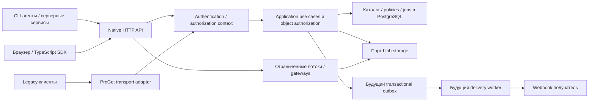

# Расширение API и интеграции сервисов

Статус: план развития, 2026-09-24. Реализованы discovery, managed keys и ограниченное делегирование B на точные аккаунты: [SERVICE_KEYS](SERVICE_KEYS.md), [SERVICE_DELEGATION](SERVICE_DELEGATION.md). Инвентаризация **95 операций**, operationId, auth/retry metadata и drift guard runtime/CI: [API_CONTRACT_GUARD](API_CONTRACT_GUARD.md). Импорт старых identities, рекурсивные роли и этапы C–E остаются планом. Навигация: [карта](API_MAP.md), [модель прав](API_ACCESS.md), [ADR 0016](adr/0016-service-access-and-api-evolution.md).

## Архитектура подключения

Схема отражает целевые обязанности. Один модуль не означает отдельный микросервис. Native и legacy не должны дублировать ACL или читать БД клиента. Передача байтов независима от работоспособности внешних бизнес-сервисов; сбой webhook не блокирует publish/download.

### Границы реализации

- `domain`: набор известных actions, типизированные selectors, чистое пересечение policies и ограничения делегирования; часы передаются как значение. Нет HTTP, SQL или внешнего policy engine.
- `application`: use cases issue/activate/rotate/revoke, authorization на объект, узкие порты CredentialStore/PolicyReader/AuditWriter по фактической потребности. Проверка права сохраняется при вызове из worker, не только из HTTP.
- `infrastructure`: криптография, SQL-транзакции и индексы, lookup credentials, outbox и delivery; таймауты/лимиты, атомарные mutations и аудит. Секрет не хранится в открытом виде ради повторного ответа.
- `contracts`: отдельные публичные DTO, runtime validation, metadata операций для OpenAPI. `Principal` и строки БД не становятся wire schema.
- `apps/api`: транспорт, регистрация маршрутов, admission до дорогого auth, создание context. `proget-compat`: перевод legacy форматов в те же application use cases.
- `sdk`: portable HTTP + AbortSignal, типизированные ошибки/пагинация/повторы. Будущие клиенты .NET/Go/Python используют тот же OpenAPI; отдельные SDK вводятся по реальной необходимости.

## Версионирование и адаптация

Существующий `/api/v1` сохраняет проверенное поведение. Новые маршруты и необязательные поля добавляются совместимо; смена смысла, обязательных полей, статусов или семантики пагинации требует версии/явного opt-in и переходного периода. Не переносить assets с items-only на несовместимый envelope скрыто. Описание deprecation содержит замену, версию и объявленную дату прекращения поддержки, без автоматического удаления по отсутствию обращений в коротком логе.

`GET /api/v1/capabilities` предлагается как способ узнать функции конкретного deployment: `apiVersions`, `gatewayRole`, `features`, `limits` (например maxObjectBytes/partBytes/maxPageSize). Нереализованные функции отсутствуют или явно false. Capability — наличие механизма, **не разрешение пользователя**; права запрашиваются отдельно в `auth/permissions`, каждый запрос всё равно проверяется сервером. Не возвращать топологию, чужие repo IDs и секреты.

OpenAPI текущего runtime остаётся 3.0.3 до отдельного проверенного перехода. Для каждой операции нужны стабильный operationId, tags, request/response/error schemas, auth scheme, обязательные заголовки, retry/concurrency и streaming ограничения. Перечень actions связывается с transport-операцией через собственное extension, например `x-depot-authorization`; для HTTP Bearer нельзя выдавать список Depot permissions за OAuth scopes в Security Requirement. Extension описывает обязательные действия и bindings, а не исполняет авторизацию. Основа такого описания — [OpenAPI Specification](https://spec.openapis.org/oas/v3.1.1.html); версия 3.1.1 здесь справочная, не заявление о миграции.

Публикуем две разные вещи: рабочую OpenAPI только реализованных операций и проектную карту расширений. Дистрибутив должен содержать соответствующую версии спецификацию и примеры без credentials. Не публикуем черновые paths как действующий SDK.

## Ограничения роста

| Область         | Решение и проверяемая граница                                                                                                                                                                                             |
| --------------- | ------------------------------------------------------------------------------------------------------------------------------------------------------------------------------------------------------------------------- |
| Auth lookup     | По key ID через индекс, hash verification, единое authoritative состояние; ограниченный DB pool и request admission. Не линейный перебор всех managed keys. Cache не вводится до определения допустимой задержки отзыва.  |
| ACL             | Сначала небольшие bounded bindings на точный repo. SQL-фильтрация до сортировки/LIMIT/агрегации; отдельные индексы под реальные запросы. Не загружать все policies/артефакты и не фильтровать в JS.                       |
| Каталог         | Cursor/keyset pages со стабильным tie-breaker, bounded filters и request deadline. Cursor связан с фильтрами; ACL проверяется заново. Snapshot exports — отдельный job, не бесконечный HTTP-ответ списка.                 |
| Control / bytes | JSON управление отдельно от потоков; лимиты активных metadata/auth запросов и резерв ресурсов, чтобы большие transfers не лишали оператора доступа. Измерить p95/p99 обоих классов.                                       |
| Передачи        | Multipart с durable parts, ETag/Range, конечные retries, integrity check, leases/fencing. Уже подтверждённые гарантии local backend не повышаются до HA только от появления нового API.                                   |
| Квоты           | account + repository + node/site: RPS, concurrent streams, bytes/s, storage/staging. Учёт всех ключей одного service account. На нескольких nodes — распределяемые конечные бюджеты, а не полный лимит в каждом процессе. |
| Очереди         | Durable jobs с ограничением backlog/возраста, bounded polling и Retry-After. Честность по аккаунту и aging приоритетов; separate foreground/background budgets.                                                           |
| События         | Transactional outbox, bounded backlog, retention/replay window, dead-letter и ручной replay. Хранение bodies ограничено; секреты и полные bytes не идут в event payload.                                                  |
| Наблюдаемость   | Metrics cardinality без key ID / artifact ID в labels; audit содержит actor/key ID/request ID/revision, не secret. Агрегация bytes не требует записи в БД на каждый chunk.                                                |

Проектируемые rate-limit ошибки новых control API — 429 + Retry-After; общий перегруз/недоступность — 503. Текущие 503/507 не заменять для существующих клиентов без проверки SDK и контрактов. Retry ограничен deadline и jitter; 401/403 не повторять бесконечно. Потерянный ответ create/complete проверяется по idempotency receipt/status, CAS-конфликт требует перечитать ресурс, не повторять старое тело с произвольной новой revision. HTTP conditional requests и Range опираются на [RFC 9110](https://httpwg.org/specs/rfc9110.html).

## События и внешние сервисы

Первый event envelope: `id`, `type`, `schemaVersion`, `occurredAt`, `repository`, `subject`, `revision`, `data`. Примеры будущих типов: `artifact.available`, `package.registered`, `asset.revision.created`, `annotation.updated`; события identity отдельно и не рассылаются обычным repository subscribers. Transactional outbox фиксируется с изменением каталога. Порядок гарантируется только в документированной области ресурса/sequence, не глобально по всем workers.

Сначала `GET R/events?after=…&limit=…` с авторизованным replay; потеря окна хранения возвращает явную необходимость resync. Затем webhooks как уведомления с at-least-once delivery: получатель дедуплицирует event ID и получает актуальные данные через API. Повтор события не должен означать повтор бизнес-операции.

Webhook URL задаёт доверенный оператор; SSRF-защита проверяет адрес, DNS resolution и каждый redirect, по умолчанию запрещает redirect и доступ к loopback/link-local/metadata endpoints. Внутренние private networks разрешаются только явной deployment allowlist. Изменение DNS не должно обходить egress policy. Подпись связывает timestamp, delivery ID и исходное тело (HMAC-SHA256), с ограниченным replay window и ротацией signing secret. Webhook signing secret — отдельный секрет, не API credential; его хранение требует выбранного secret store/encryption-at-rest и отдельного контракта, поэтому не включается автоматически в этап ключей.

Повторная доставка ограничена числом попыток/сроком/полосой; накопление или недоступность получателя не задерживает загрузку. Перед отправкой проверяются актуальные права subscription owner и разрешённые поля. Если получателю отозван доступ, queued payload не отправляется по прежнему grant. Audit и метрики фиксируют неудачи без токенов/чувствительного body.

Transfer tickets — отдельный последующий контракт: ровно один immutable object, метод, hash, audience шлюза, TTL и лимит; запрос выдачи требует соответствующего data permission. Долгий download и Range retries явно согласуются со сроком допуска. Долговечный API key нельзя пересылать через redirect на произвольный host; такой клиент проверяет allowlist/audience. Cookies, public download links и presigned query URLs не добавляются под видом service-key auth.

Внешний OAuth/OIDC позже может преобразовывать проверенную workload identity в локальную policy. Внешняя группа сама по себе не делает principal администратором. Недоступность провайдера не отключает локальную проверку прав и не включает anonymous. Федерация и multi-tenant режим не обязательны для первого автономного релиза.

## Совместимый переход со старых ключей

1. Добавить новые таблицы без удаления старого файла. Миграция данных, runtime activation и переключение клиентов — разные операции. Текущие rolling/HA гарантии не расширяются без испытаний.
2. Старые ключи получают явный `legacy` credential profile. Его frozen mapping воспроизводит **только нынешние use cases**: `read` для current read routes, `write` для owned uploads/jobs и audit, read+write для annotation/package/asset/reference mutations; administrator для текущего identity API. Они не получают новые deletion, webhook, credential или policy management права автоматически.
3. `legacy` — метка источника/версии policy, а не поле, которое клиент может прислать. Статические permissions не превращаются в wildcard. Новый managed key использует новые actions даже на существующем native/legacy маршруте; application проверяет операцию, а не присваивает ему общий `read` ради старого helper.
4. Импорт старого ключа из hash требует явного сопоставления старого `id` с service account: это сохраняет ownership uploads/jobs/references и квоты. Не создавать новый случайный owner при каждой ротации. Импорт возможен локальной административной процедурой; secret из hash не восстанавливается.
5. На переходе у одного credential один authority. Нельзя оставлять hash одновременно в file fallback и managed store после включения DB revoke: это воскресит отозванный ключ. Все gateways/workers получают согласованную конфигурацию. Неизвестный `dpk_` credential никогда не пробуется как legacy key после неуспешной проверки.
6. Переводить сервисы по одному: выпуск → активация → негативная/положительная проверка → отзыв/удаление прежнего file entry с согласованным restart. Rollback новой схемы не должен вновь включать уже отозванные ключи; без совместимого credential authority откат к старому runtime запрещён до безопасной переконфигурации.

В последующих этапах можно унифицировать пользовательские group grants и детальные policies. До этого user sessions сохраняют точные прежние права; нельзя молча расширить их из новых role templates. Зафиксировать mapping memberships и admin grants до внедрения делегированного identity administration.

## План вертикальных инкрементов

Исходная карта охватывала 41 операцию. Сейчас полный inventory включает 95 операций с HEAD/legacy, service access/discovery и delegation. Поднабор B позволяет root назначать конкретному key ID управление конкретным account ID с actions/ceiling, без цепочек и самоуправления. Новый account получает новый owner; импорт старого ownership пока отсутствует. Контрактная часть A проверяет весь зарегистрированный inventory: [приёмка](API_CONTRACT_GUARD.md). Рабочие поднаборы B: [ключи](SERVICE_KEYS.md), [делегирование](SERVICE_DELEGATION.md); полная исходная модель B ещё не объявляется завершённой.

| Этап                              | Состав                                                                                                                                        | Условие готовности                                                                                                                                                      |
| --------------------------------- | --------------------------------------------------------------------------------------------------------------------------------------------- | ----------------------------------------------------------------------------------------------------------------------------------------------------------------------- |
| A. Проверяемый контракт           | Полная текущая карта, operationId, исправление расхождений OpenAPI/runtime, auth requirement metadata, capabilities + собственные permissions | CI сверяет route inventory и OpenAPI; для каждой операции явны public/auth/resource/ownership; SDK работает по опубликованной схеме                                     |
| B. Managed service keys           | Стабильные аккаунты, точные repo bindings, authorizer, issue/activate/rotate/revoke/expiry, delegation ceiling, атомарный аудит и лимиты      | CI публикует своим ключом, не скачивает и не пишет в чужой repo; ротация сохраняет upload; отзыв закрывает новый запрос и queued commit; legacy работает без расширения |
| C. Каталог и узкие ресурсы        | Пагинация assets/accounts/keys, репозиторные карточки; namespace selectors и upload intent отдельным подэтапом                                | Полный обход большого каталога; прямой artifactId, aliases, search/history и source/target не обходят ACL; plan запросов и bounded memory проверены                     |
| D. Интеграционные события         | Event cursor → outbox → webhook delivery, retry/replay, подпись/egress                                                                        | Crash после commit не теряет событие; повтор дедуплицируется; отключённый сервис не тормозит bytes; revoke до delivery закрывает отправку                               |
| E. Эксплуатация и масштабирование | Retention, наблюдаемость, replicated storage barriers, distributed budgets/tickets после выбора инфраструктуры                                | Смешанная нагрузка и отказы двух узлов подтверждают бюджет, сохранность и согласованные RPO/RTO                                                                         |

A и B можно реализовывать локально, сохраняя отказные тесты PostgreSQL. Стенд ProGet и двух серверов остаётся отложенным по решению владельца; локальная приёмка не заменяет эти испытания. Этапы адаптера ProGet выполняются параллельно по roadmap, с общей новой авторизацией и реальными fixtures, когда появится стенд.

### Обязательные contract/security сценарии

- Runtime route отсутствует в OpenAPI/permission registry — CI fail, кроме явного списка static/CORS/internal exclusions. HEAD и legacy учтены отдельно.
- Подмена resource ID, repository, owner, job ID, key ID, sourceRevision; service A не видит и не изменяет объекты B. Administrator без data grant не читает bytes.
- Контрактные ответы во всех отрицательных случаях проходят schema validation; secrets отсутствуют в list/get/audit/errors, mock примеры не являются рабочими ключами.
- Переход policy revision во время операции, истечение срока, утрата ответа выдачи/активации/ротации, повтор revoke; старый ключ не оживает через fallback/cache/restart/rollback.
- Все credentials одного service account суммарно соблюдают лимит; consumer без content.read получает отказ также на HEAD/Range/legacy.
- Публикация 5 GiB с interruption/resume и policy change; worker повторно проверяет права. Никакой зависимости памяти от размера файла.
- Cursor фильтрует права до page limit, новые объекты/отзыв прав не раскрывают чужие counts/metadata. Изменение policy между страницами не закрепляет старое разрешение.

## Решения, зависящие от эксплуатации

До production подтвердить количество service accounts/ключей и запросов в секунду; срок/процедуру ротации; нужные реальные клиенты и их auth формы; допустимую задержку отзыва уже начатого stream; ОС/БД/replication/fencing и RPO/RTO. До этих ответов используем безопасный локальный профиль без обещаний производительности, multi-tenant isolation или доступности при потере authority.
