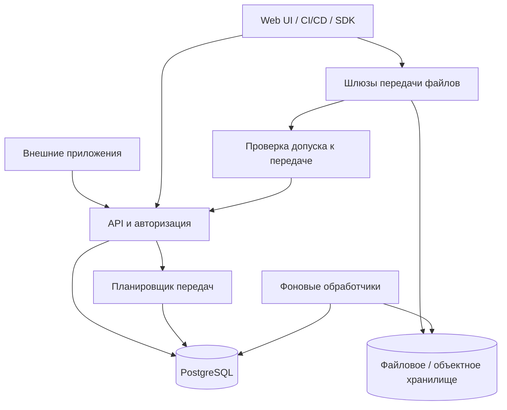

# План автономного хранилища пакетов и файлов

> Целевой план продукта. Уже реализованный standalone subset и его ограничения: [CORE_RUNBOOK](CORE_RUNBOOK.md), [CORE_VALIDATION](CORE_VALIDATION.md).

Дата: 22 сентября 2026 года. Статус: архитектурный план; каркас ProAnima Arkvory подготовлен, продуктовые функции ещё не реализованы.

Это рабочая версия плана отдельного проекта `ProAnima/Arkvory`. Все изменения плана хранилища ведутся здесь. Фактическая структура модулей и инструменты описаны в [ARCHITECTURE.md](ARCHITECTURE.md) и [README](../README.md).

## 1. Цель и исходные условия

Создать отдельный продукт: сетевое хранилище UPack и обычных файлов с собственным интерфейсом, API, метаданными, маркировкой, правами, очередями и управлением передачами. Внешние клиенты подключаются к нему по сети и могут работать на других компьютерах. Остановка клиентского приложения не влияет на раздачу пакетов.

Подтверждено: около 4 ТБ исходных данных; отдельные файлы — десятки гигабайт и больше, фиксированного предела размера нет; используются UPack и обычные файлы; клиенты — агенты развёртывания, CI/CD и другие инструменты. Клиенты подключаются через нативный API, SDK и CLI; исходные данные переносятся проверяемым импортом ([MIGRATION](MIGRATION.md)).

Решение по стеку: новое хранилище разрабатывается на TypeScript со строгой проверкой типов (`strict: true`).

Главный приоритет: целостность и доступность опубликованных файлов, затем предсказуемая работа при перегрузке, затем удобство управления. Задача не предполагает поддержку других форматов пакетов без отдельного требования.

Рабочая гипотеза для проектирования HA: переживать отказ одного сервера в одной площадке. Это не подтверждённое требование пользователя. Количество серверов, ОС, сеть, география, нагрузка и допустимая стоимость ещё определяются. Отказ целой площадки потребует отдельного профиля.

## 2. Границы сервиса

- Собственный репозиторий, сборка, выпуск, конфигурация и цикл обновления.
- Собственная БД и права; никаких прямых обращений к БД внешних приложений.
- Нативный версионированный API `/api/v1`, OpenAPI, примеры и небольшой клиентский SDK.
- Единственный публичный протокол — нативный API; сторонние протоколы совместимости не поддерживаются ([ADR 0045](adr/0045-native-only-api.md)).
- Внешние клиенты хранят идентификаторы объектов и версий, а не физические пути или временные ссылки.
- Файлы скачиваются напрямую из хранилища без проксирования через клиентские приложения.
- Хранилище не вызывает клиентские приложения синхронно при скачивании, публикации или авторизации.
- Базовая установка проста; требования к кластеру явно описываются отдельным профилем. Один сервер нельзя называть отказоустойчивым к потере этого сервера.

## 3. Архитектура и выбор технологий



Стек хранилища: TypeScript в strict-режиме для backend, worker, планировщика, web UI и SDK. Для backend предлагаем Node.js поддерживаемой LTS-линии и Fastify; PostgreSQL — для метаданных и устойчивых очередей, Nginx — на шлюзах передачи. Версии фиксируются на этапе 0. Управление, обработчики и планировщик — роли одной кодовой базы, а не набор независимо разрабатываемых микросервисов. UI-фреймворк выбирается отдельно; требование TypeScript распространяется на него независимо от выбора.

Большие файлы отдаются файловым шлюзом; проверки ZIP, хеширование и импорт выполняются вне event loop API. Для локального backend применяем внутреннюю выдачу Nginx после проверки прав. Для объектного backend шлюз выполняет потоковое проксирование. Прямые подписанные ссылки в object storage допускаются только в профиле, где не требуется строгое ограничение полосы нашим шлюзом.

В первой версии не требуются отдельные Redis, Kafka и поисковый кластер. Поиск по каталогу, индексируемым метаданным и тексту — в PostgreSQL. Отдельную очередь/поисковую систему добавляем по измеренным ограничениям.

Два backend хранения: `LocalBlobStore` для односерверной установки и `ObjectBlobStore` для S3-совместимого сервиса. HA-профиль использует уже проверенное отказоустойчивое хранилище; сам протокол S3 не гарантирует репликацию и доступность. Выбор конкретной реализации, топологии и подтверждений записи — результат этапа 0. Собственную распределённую файловую систему не разрабатываем.

### 3.1. Строгая типизация и границы модулей

Базовые параметры компилятора для всех TypeScript-пакетов:

```json
{
  "compilerOptions": {
    "strict": true,
    "noUncheckedIndexedAccess": true,
    "exactOptionalPropertyTypes": true,
    "noImplicitOverride": true,
    "noFallthroughCasesInSwitch": true,
    "noEmitOnError": true
  }
}
```

Это фрагмент общей конфигурации; настройки модулей, target и сборки уточняются для Node.js и браузера. Дополнительные флаги задаются явно, а не считаются частью `strict`. CI выполняет проверку типов, lint и контрактные тесты. Не используем отключение strict, необоснованные `any`, `@ts-ignore` или приведения типов для обхода ошибок; исключения сторонних библиотек локализуются в адаптерах и документируются.

Внешние данные поступают как `unknown` и проверяются во время выполнения: JSON API, настройки, метаданные UPack, события и ответы интеграций. Статические типы TypeScript не заменяют эту проверку. Согласованные схемы определяют валидацию, OpenAPI и типы SDK; проверяем расхождения автоматически.

Состояния публикаций и задач описываем discriminated unions с явными разрешёнными переходами. Ошибки имеют стабильные коды. Для файлов 5 ГБ используем streams с backpressure и отменой, не `readFile`/целый Buffer в памяти. Проверки архивов и CPU-затратные операции выносим из основного event loop. Размеры/смещения проверяем как неотрицательные безопасные целые; для полных 64-битных значений используем bigint внутри и десятичные строки в нативном JSON-контракте.

Границы пакетов: `domain` (правила и состояния), `application` (сценарии и порты), `contracts` (публичные схемы), `sdk` (HTTP-клиент), `infrastructure` (адаптеры); приложения `api`, `worker`, `scheduler`, `web`. Это модули/пакеты одного проекта; каждому не нужен отдельный сервер. Внешние приложения используют версионированный SDK и публичные контракты, но не импортируют внутренние модели БД или код планировщика.

## 4. Модель данных и управление каталогом

| Сущность                        | Назначение                                                                          |
| ------------------------------- | ----------------------------------------------------------------------------------- |
| Repository                      | Изоляция пакетов или файлов, права, квоты, политики                                 |
| Package / PackageVersion        | UPack: repository + group + name + version; исходная и нормализованная идентичность |
| Asset / AssetRevision           | Путь обычного файла и неизменяемые ревизии содержимого                              |
| Blob                            | Объект содержимого: внутренний ID, SHA-256, размер, backend, состояние проверки     |
| MetadataSchema                  | Разрешённые поля, типы, ограничения, обязательность, индексы                        |
| Label / Collection              | Маркировка и логическая группировка без копирования файлов                          |
| UploadSession / TransferJob     | Части загрузки, очередь, резерв ресурсов, допуск к передаче                         |
| ExternalReference               | Ссылка внешней системы на конкретную версию, защищающая от очистки                  |
| Principal / Policy / AuditEvent | Сервисные аккаунты, права и история действий                                        |
| OutboxEvent / BackgroundJob     | Надёжная доставка событий и повторяемые фоновые операции                            |

Идентичность UPack включает group, в том числе пустую группу. Правила регистра и версий задаются собственным контрактом каталога. Обычные пути имеют собственные явно описанные правила; заранее проверяются коллизии регистра при миграции. Внутренние пути blob не строятся из пользовательских имён.

Содержимое blob неизменяемо. Перезапись asset атомарно переводит путь на новую ревизию. Начатое скачивание привязано к старому blob и не меняется в середине передачи. Перезапись версии пакета, если её разрешит отдельная политика, также создаёт новый blob с аудитом и защитой активных читателей.

Разделяем три уровня метаданных:

1. Исходные поля `upack.json`: сохраняем без перепаковки UPack.
2. Редактируемые свойства каталога: описание, владелец, платформа, архитектура, build/commit, дополнительные поля по схеме.
3. Управляемые статусы и метки: approved, deprecated, quarantined, channel, environment. Права на изменение статуса выпуска отделены от права загрузки.

Меняя метки каталога, не меняем хеш файла. Если требуется изменить metadata внутри UPack, это отдельная операция создания пакета. Для полей каталога предусматриваем версии изменений и `If-Match`, чтобы конкурентные редакторы не затирали друг друга.

Collections объединяют версии из разных репозиториев без физического перемещения. Поиск, фильтры, счётчики и коллекции учитывают ACL. Пользовательские схемы имеют ограничения по размеру, глубине и числу индексируемых полей. Метки не заменяют права доступа.

В UI нужны: каталог и дерево файлов, фильтры и сохранённые подборки, карточка версии с хешем и происхождением, массовые изменения меток, история ревизий, зависимости/внешние ссылки, монитор передач и очереди, управление квотами, пользователями и ключами. Для фоновых операций показываем состояние и причину ошибки.

## 5. Публикация и целостность

Нативная загрузка: создать сессию → получить допуск и резерв места → передать части → завершить → проверить → опубликовать. Состояния: `queued → reserved → uploading → verifying → available`; отдельно `failed`, `cancelled`, `expired`. Размеры и смещения — 64-битные.

- Сессия и принятые части переживают перезапуск. Часть имеет индекс/смещение, длину и контрольную сумму. Повтор той же части допустим; конфликт данных отклоняется.
- Подтверждение части означает её устойчивое сохранение согласно профилю. Для HA недостаточно оставить единственную копию на погибающем шлюзе.
- Перед завершением проверяются полнота покрытия, отсутствие пересечений, ожидаемый размер и итоговый SHA-256; multipart ETag объектного backend не используется как подмена SHA-256.
- UPack проверяется как ZIP/ZIP64 с ограничениями размера метаданных, числа записей и распаковки. Небезопасные пути и неоднозначные записи отклоняются. Полная распаковка для раздачи не нужна.
- Успех публикации возвращается после сохранения blob с требуемой долговечностью и фиксации доступной версии в БД. Синхронный ответ об успехе не означает лишь постановку в очередь.
- Распределённой транзакции между БД и blob-store нет: используем промежуточные состояния, повторяемое завершение и reconciliation. Зависший объект проверяется до появления в каталоге.
- Повтор завершения после потери ответа возвращает прежний результат по idempotency key. Повтор с другим содержимым не считается тем же действием.
- Временные объекты, старые ревизии и мусор удаляются после grace period, проверки ссылок и активных передач. Сначала мягкое удаление; физическая очистка — отдельная задача.

Дедупликация целых одинаковых объектов возможна внутри заданной области изоляции. Она не обязательна для первого выпуска и не должна раскрывать наличие чужих файлов. Поблочную дедупликацию откладываем.

## 6. Очереди и управление ресурсами

Три независимых назначения: очередь приёма файлов, очередь раздачи и очередь фоновых работ. В очередь помещается описание задачи; байты находятся во временном blob-store. Ожидание не занимает гигабайты RAM или открытые HTTP-соединения в нативном API.

Планировщик учитывает: общий бюджет чтения/записи, сеть площадки, лимит шлюза, доступное место, квоты репозитория и принципала, число активных передач, ограничения backend. Upload и download имеют отдельные бюджеты, но конкуренция за диски и общие сетевые участки учитывается совместно.

Политика старта:

- Классы: служебные метаданные, рабочие установки агентов развёртывания, пользовательские передачи, CI, миграция/репликация. Реальные веса задаются администратором после измерений.
- Справедливое распределение между принципалами внутри класса, а не только между IP: за NAT могут находиться разные пользователи.
- Ограничение числа одновременных передач на принципала; большой набор потоков не даёт захватить всю полосу.
- Повышение приоритета долго ожидающих задач, минимальная доля полосы для фоновых классов; большие файлы не должны бесконечно уступать маленьким.
- Ограничения длины очереди, времени ожидания и размера зарезервированного staging. Резерв истекает, если клиент не начинает загрузку.
- Оценка времени ожидания приблизительна. Отмена и пауза для нативного клиента освобождают допуск; прогресс загрузки сохраняется. Возобновление скачивания делает клиент через Range.

Устойчивая очередь реализуется в PostgreSQL: короткий захват задачи через `FOR UPDATE SKIP LOCKED`, lease с TTL, heartbeat, число попыток, backoff с jitter и отдельный список окончательных ошибок. Транзакция не удерживается на время передачи. Доставка задач — как минимум один раз; операции идемпотентны. Для устаревшего обработчика используется generation/fencing token, чтобы он не завершил уже переназначенную задачу.

Шлюз держит активные передачи локально и соблюдает выданный бюджет. При потере связи с координатором не выдаёт новые допуски за пределами действующих ограничений. Просроченный lease не должен разрешать бесконечную передачу параллельно с новым владельцем. Семантику остановки/продления проверяем испытаниями при сетевом разделении.

Нативный протокол: создать transfer job → получить `queued` и URL состояния → дождаться допуска через polling/SSE → получить короткоживущий transfer token → начать передачу. Допуск повторно проверяет права и состояние объекта; он закреплён за неизменяемым blob. Потеря UI не удаляет задание.

Синхронный протокол: GET скачивания (по ID, пакету и пути файла) и целый PUT сохраняют ожидаемое синхронное поведение. Допускается короткое ожидание, согласованное с тайм-аутами клиентов. При перегрузке — документированный ответ и Retry-After там, где клиент умеет повторять. Нельзя вместо байтов вернуть JSON задания или 202. Для клиентов без retry нужен запас ёмкости/выделенный лимит либо изменение клиента. Целый PUT автоматически возобновляемым не становится; для продолжения используется multipart.

## 7. Балансировка сети и раздача

Различаем распределение HTTP-запросов по шлюзам и управление суммарной полосой. Алгоритм «меньше соединений» не знает скорость и стоимость каждого потока. Планировщик распределяет бюджеты с учётом измеренных байт/с, доступности объекта, загрузки диска и резерва шлюза.

Для простого первого алгоритма используем лимиты параллелизма плюс консервативные бюджеты байт/с на шлюз и класс, периодически перераспределяемые. Локальные лимиты на запрос не равны общему лимиту клиента или кластера. Строгое общее ограничение требует учёта всех его потоков, а upload shaping — отдельного механизма шлюза/ОС; это предмет обязательного прототипа этапа 3.

Для клиентов с постоянным credential используем стабильный hostname и внутреннее проксирование: редирект на другой host может изменить поведение авторизации клиента. Нативные клиенты могут получать адрес подходящего шлюза с ограниченным токеном. Адрес должен быть доступен из их сети.

Скачивание: GET/HEAD, Content-Length, сильный ETag, Range/If-Range, корректные 206/416 и отсутствие преобразования байтов. Набор поддерживаемых многодиапазонных запросов фиксируется контрактом. Переход на другой узел выполняется новым запросом к тому же blob. Уже открытое TCP-соединение при падении узла не переносится; продолжение зависит от клиента.

Если появятся несколько площадок: вводим локальные шлюзы-кеши по хешу, маршрутизацию по доверенной привязке клиента к площадке, ограничение межплощадочного канала и предварительную доставку релизов. Несколько запросов одного отсутствующего объекта объединяем в одну задачу наполнения кеша. Это отдельный этап после подтверждения географии. Несколько шлюзов за одним uplink не увеличивают пропускную способность uplink.

## 8. Отказоустойчивость и режимы деградации

| Профиль              | Состав и гарантия                                                                                                                                     |
| -------------------- | ----------------------------------------------------------------------------------------------------------------------------------------------------- |
| Standalone           | Один сервер, PostgreSQL, диск, резервная копия; восстановление после сбоя, без гарантии доступности при потере сервера                                |
| HA на одной площадке | Два и более API/шлюза в разных доменах отказа; отказоустойчивый входной адрес; HA PostgreSQL; blob-store с подтверждённой устойчивостью к потере узла |
| Несколько площадок   | Локальная раздача, отдельная политика репликации и переключения; RPO/RTO при потере площадки согласуются отдельно                                     |

В HA резервируем все зависимости: входной балансировщик, DNS/VIP по выбранной схеме, БД, содержимое, ключи подписи/проверки токенов. Один NAS, единственная БД или единственный балансировщик остаются точкой отказа даже при нескольких API-процессах. Свидетель кворума может помогать выбору лидера, но не является копией данных.

Для БД используем готовый механизм управления failover с кворумом и fencing, а не собственное голосование в приложении. Синхронность и допустимый переход в degraded-режим фиксируются конфигурацией. Нельзя одновременно обещать RPO=0 и автоматически подтверждать новые записи без необходимой реплики. При потере безопасного кворума публикации приостанавливаются; доступная раздача продолжается в установленных границах.

При недоступном API/БД шлюз может обслуживать только уже выданные ограниченные transfer tokens по известному blob, если профиль это разрешает. Срок такой работы ограничен TTL; отзыв прав имеет ту же явно принятую задержку. Новые авторизации и обычные запросы без допуска не переводятся в анонимный режим. Открытый поток может продолжаться при доступных байтах; потеря его storage backend может оборвать передачу.

| Отказ                        | Ожидаемая реакция                                                                                                                |
| ---------------------------- | -------------------------------------------------------------------------------------------------------------------------------- |
| Внешнее приложение выключено | Хранилище и прямые клиенты работают                                                                                              |
| API/шлюз выключен            | Новые запросы направляются на здоровый узел; оборванные передачи возобновляются клиентом                                         |
| Планировщик выключен         | Действующие допуски соблюдаются; задачи подхватываются после lease/failover                                                      |
| БД потеряла лидера           | Ограниченная пауза управления; безопасное переключение, без двух писателей                                                       |
| Узел blob-store выключен     | Доступность опубликованных байтов обеспечивается выбранной схемой хранения                                                       |
| Заканчивается место          | Новые загрузки ограничиваются до повреждения рабочей ёмкости; чтение сохраняется                                                 |
| Не дошёл webhook             | Повтор с курсора ленты изменений (outbox нет, [ADR 0069](adr/0069-webhooks-over-change-feed.md)); опубликованные данные доступны |

Предварительная цель испытаний HA: RPO=0 для подтверждённых публикаций при одиночном отказе в пределах выбранной топологии; восстановление новых запросов до 60 секунд. Это проектные цели, не достигнутые гарантии. Отдельно измеряются возобновление клиентских передач и длительность восстановления из backup. Гарантия потери всей площадки пока не задаётся.

Резервирование: согласованный backup метаданных и содержимого, хранение истории/WAL по политике, отдельный домен отказа, защита backup от обычного удаления, регулярное восстановление на чистую среду. Репликация не заменяет backup. Очистка blob учитывает ещё действующие точки восстановления.

## 9. Безопасное подключение внешних приложений

- TLS с проверкой сертификатов; при необходимости mTLS между сервисами. Не переносим нынешнюю настройку игнорирования TLS-ошибок в новую интеграцию.
- Отдельный service account для каждого внешнего приложения, CI и агента развёртывания; ограничение repository/action, ротация и отзыв ключей.
- Раздельные действия: list/read, upload, overwrite, delete, edit metadata, approve/promote, manage access.
- Внешнее приложение проверяет права своего пользователя до выполнения действия своим service account. Для полноценного разграничения по пользователям добавляется проверяемая делегация, а не доверие произвольному `X-User`.
- Интеграционный клиент имеет короткие тайм-ауты управления, ограниченные повторы только безопасных/идемпотентных операций и отображение состояния недоступности хранилища.
- Внешнее приложение может кешировать каталог для UI, но не выдаёт кеш как подтверждение успешной публикации.
- Внешние ссылки продуктов регистрируются идемпотентно в хранилище до завершения публикации продукта. При незавершённом процессе возможна лишняя защитная ссылка, но не преждевременное удаление компонента. Удаление ссылок и сверка — отдельные операции; недоступность внешнего приложения сама по себе не снимает защиту.
- Webhooks подписаны, содержат event ID, повторяются и могут дублироваться. Потребитель ведёт дедупликацию и может восстановить состояние через API событий/каталога.
- Transfer token ограничивается объектом, действием, сроком и допуском; его нельзя превращать в право читать весь репозиторий. Секреты и query keys редактируются из логов.
- Адреса webhook и удалённого импорта задаются доверенными администраторами с сетевыми ограничениями. UI безопасно отображает пользовательские метаданные и имена файлов.

## 10. API и развитие контракта

Клиенты подключаются по HTTP/OpenAPI независимо от языка реализации. Для TypeScript предоставляется SDK хранилища. Совместное использование контрактов не связывает графики обновления: версии API/SDK поддерживают согласованное окно совместимости.

Нативные группы `/api/v1`:

| Группа                         | Возможности                                                      |
| ------------------------------ | ---------------------------------------------------------------- |
| repositories                   | Создание, настройки, квоты, права, политики хранения             |
| packages / versions            | Каталог UPack, версии, метаданные, скачивание, публикация        |
| assets / revisions             | Дерево файлов, пути, ревизии, восстановление, операции с папками |
| labels / collections / schemas | Маркировка, подборки, схемы метаданных, поиск                    |
| uploads                        | Создание сессии, части, прогресс, завершение, отмена             |
| transfers                      | Очередь, допуск, состояние, отмена, разрешённый приоритет        |
| references                     | Защита версий, используемых внешними продуктами                  |
| events / webhooks / audit      | Изменения, интеграционные уведомления, история                   |
| administration                 | Узлы, классы трафика, лимиты, служебные задания                  |

Общие правила: стабильные ID, UTC, пагинация курсором, фильтры, машинные коды ошибок, request ID, optimistic concurrency и идемпотентность записей. Публичный API не раскрывает физические пути хранения. `/health/live`, `/health/ready` и метрики имеют разные назначения.

Скачивание по идентичности: `GET|HEAD /api/v1/repositories/{repository}/packages/content?group=&name=&version=` (без `version` — старшая стабильная SemVer; диапазоны и стадии — [PROMOTION](PROMOTION.md)) и `GET|HEAD /api/v1/repositories/{repository}/asset/content?path=` для текущей ревизии файла. Права, admission, Range/ETag и полоса те же, что у скачивания по ID. Аутентификация — только `Authorization: Bearer`. Сторонние протоколы совместимости не поддерживаются ([ADR 0045](adr/0045-native-only-api.md)).

Публичный контракт `/api/v1`, OpenAPI и SDK меняются аддитивно либо через ADR. Поддержка подтверждается собственными SDK/CLI и фикстурами с известным происхождением; записывающие тесты не выполняются на рабочих репозиториях. Неподдержанные методы не возвращают фиктивный успех.

## 11. Нагрузка, ёмкость и эксплуатация

4 ТБ — логический объём исходных данных. Плановая физическая ёмкость = данные с коэффициентом репликации/кодирования + staging + сохраняемые ревизии + запас роста и восстановления. Backup и временно сохраняемый исходный источник данных считаются отдельно. Две полные копии 4 ТБ требуют около 8 ТБ только для самих байтов; точный размер зависит от backend и политики.

Бюджет staging учитывает принятые части, параллельные загрузки и возможную дополнительную копию при сборке. Число загрузок ограничивается до превышения свободного места. Подтверждённое завершение не должно требовать неучтённых дополнительных 5 ГБ.

Начальная тестовая матрица: файлы от килобайт до 5 ГБ, смешанные операции, 1/10/50 параллельных передач. Эти числа — сценарии измерения, не обещанная производительность. Итоговые лимиты определяются по реальным дискам, сети, числу клиентов и потоков.

Измеряем: пропускную способность, память на поток, время до первого байта, p95/p99 API, ожидание по классам, отклонённые запросы, ошибки и повторы, место staging, возраст фоновых задач, лаг репликации, целостность и возраст backup. Длинные передачи не должны блокировать каталог и авторизацию. Агрегированные метрики и аудит не требуют синхронной записи каждого блока в БД.

## 12. Этапы реализации и критерии завершения

| Этап                              | Результат                                                                                                 | Критерий перехода                                                                                                      |
| --------------------------------- | --------------------------------------------------------------------------------------------------------- | ---------------------------------------------------------------------------------------------------------------------- |
| 0. Контракты и инфраструктура     | Инвентаризация потребителей, сценариев и объектов, сеть, профиль HA, backend, целевые RPO/RTO, схема прав | Зафиксированы обязательные сценарии и топология без скрытых точек отказа                                               |
| 1. Вертикальный прототип передачи | Отдельный сервис, БД, потоковый приём, UPack и asset, проверка хеша, GET/HEAD/Range, перезапуск           | Файл 5 ГБ сохраняется и скачивается без зависимости памяти от размера; частичный файл не публикуется                   |
| 2. Каталог и безопасность         | Модель версий/ревизий, метаданные, метки, коллекции, права, аудит, UI                                     | Поиск учитывает права, конфликтующие правки обнаруживаются, перезапись не повреждает текущий download                  |
| 3. Очереди и QoS                  | Устойчивые сессии и задачи, fairness, лимиты сети/диска, admission, два шлюза                             | После перезапуска нет двойной публикации; медленный клиент и большой поток не блокируют остальных; измерен общий лимит |
| 4. Внешние клиенты                | Нативный API, SDK и CLI для интеграций, внешние ссылки, webhooks                                          | Агенты развёртывания, CI и прочие клиенты проходят контрактные сценарии через SDK/CLI; клиент работает с другой машины |
| 5. HA и восстановление            | Выбранный HA backend, HA БД/вход, отказ узлов, backup/restore, rolling update                             | Испытания с отключением узла и сетевым разделением подтверждают согласованные RPO/RTO                                  |
| 6. Миграция и пилот               | Возобновляемый импорт, сверка, ограниченная группа рабочих клиентов                                       | Совпадают объекты, байты, метаданные, права; показатели пилота приемлемы                                               |
| 7. Переключение                   | Финальная дельта, стабильный hostname, инструкции отката и эксплуатации                                   | Нет пропущенных рабочих сценариев; проверено восстановление; исходный источник можно вывести из эксплуатации           |

Этапы 1–4 выполняются итеративно с ранней проверкой клиентов. Автономность проверяется уже на этапе 1. HA не объявляется готовой до этапа 5. Календарные оценки даются после этапа 0 и прототипа, исходя из состава команды и выявленных сценариев.

## 13. Обязательные испытания

1. Остановка API, шлюза и worker во время загрузки, проверки, фиксации публикации и скачивания.
2. Потеря ответа об успешном завершении: повтор не создаёт дубль и возвращает проверяемый результат.
3. Потеря узла хранения и лидера БД; сетевое разделение, устаревший worker, переполнение staging.
4. Неверная/повторная/перекрывающаяся часть, повреждённый ZIP64, неверный хеш, опасный путь, слишком большие метаданные.
5. Конкурентная перезапись, удаление при активном download, очистка версии с внешними ссылками.
6. Перегрузка по каждому классу: bounded queue, отсутствие голодания и захвата полосы множеством потоков одного клиента.
7. Отзыв ключа, истечение transfer token, отсутствие доступа к чужим объектам через поиск, Range или кеш.
8. Агенты развёртывания, CI, SDK/CLI и прочие клиенты: штатная работа, очередь/перегрузка, обрыв, повтор, точные коды и формы ответов.
9. Внешнее приложение полностью выключено, а хранилище продолжает обслуживать остальных клиентов.
10. Восстановление на чистые серверы и полная сверка контрольных сумм выбранной проверочной выборки; перед выводом исходного источника — сверка всех перенесённых объектов.

## 14. Перенос и откат

Импорт — фоновая задача с ограниченной полосой и сохранённым журналом: инвентаризация всех версий/путей → перенос исходных байтов → перенос дополнительных метаданных/прав → сверка → повторная дельта. Переносимые права сопоставляются явно, а известные ключи источника импортируются защищённо. Неизвестные секреты нельзя восстановить из хешей.

В финальное окно запись в старый источник останавливается; учитываются добавления, изменения и удаления. На каждый репозиторий/каталог в каждый момент существует один источник записи. Сохраняем старый hostname и TLS при переключении, если инфраструктура позволяет.

Исходный источник временно остаётся read-only на резервном адресе. До допуска новых публикаций утверждается механизм обратного переноса новых версий и изменённых assets для отката. Откат после записей в новую систему — это синхронизация данных с остановкой записи, затем возврат маршрутизации, а не только смена DNS.

## 15. Решения, которые ещё нужно уточнить

- Один сервер, отказ одного узла или потеря площадки: обязательный уровень первой промышленной версии.
- Число машин, ОС, тип дисков, наличие готового HA PostgreSQL/object storage/NAS и реальные домены отказа.
- Площадки, скорости сети, одновременные загрузки/скачивания, профиль всплесков агентов развёртывания.
- Версии клиентов, используемые методы и тайм-ауты.
- Правила перезаписи UPack/assets, срок хранения ревизий, публичное чтение и требования к отзыву доступа.
- Допустимые RPO/RTO, время обслуживания, владельцы эксплуатации и резервных копий.

До ответов не выбираем число серверов и не обещаем скорость или доступность. Архитектурные интерфейсы и первый прототип от этих чисел не зависят.

## 16. Первичные источники

- [RFC 9110](https://www.rfc-editor.org/rfc/rfc9110.html) — Range, If-Range, HTTP-статусы и Retry-After; эти механизмы не гарантируют поддержку retry конкретным клиентом.
- [Nginx core](https://nginx.org/en/docs/http/ngx_http_core_module.html) — внутренняя выдача и ограничения скорости; сами по себе не являются распределённым планировщиком.
- [Nginx proxy](https://nginx.org/en/docs/http/ngx_http_proxy_module.html#proxy_request_buffering) — потоковая передача запроса и ограничения переключения upstream после начала передачи тела.
- [PostgreSQL SELECT](https://www.postgresql.org/docs/current/sql-select.html) — SKIP LOCKED для конкурентных обработчиков очереди.
- [PostgreSQL standby replication](https://www.postgresql.org/docs/current/warm-standby.html) — компромиссы синхронной/асинхронной репликации; выбор политики failover — часть инфраструктуры.
- [TypeScript TSConfig](https://www.typescriptlang.org/tsconfig/) — strict-режим и дополнительные проверки типов.
- [Fastify TypeScript](https://fastify.dev/docs/latest/Reference/TypeScript/) — типизация предлагаемого HTTP backend.
- [Fastify Reply](https://fastify.dev/docs/latest/Reference/Reply/) — потоковые ответы HTTP.

Источники проверены 22 сентября 2026 года.
