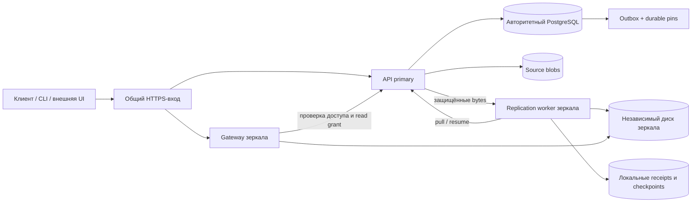

# Репликация Arkvory: протокол и план реализации

Статус: **проект, runtime не реализован**. Дата: 2026-09-26. Основание: два сервера, около 4 ТБ, объекты десятков гигабайт и больше, поддержка кластеров и зеркал. Физические испытания отложены владельцем. Этот документ дополняет [TWO_NODE_PLAN](TWO_NODE_PLAN.md), а не объявляет существующие shared-storage readers репликами.

## Два разных режима

| Свойство            | Переносимое зеркало                                                       | Синхронный HA-профиль                                                                   |
| ------------------- | ------------------------------------------------------------------------- | --------------------------------------------------------------------------------------- |
| Назначение          | Независимая копия опубликованных файлов и дополнительная раздача          | Сохранение подтверждённых записей и смена активного узла                                |
| ОС                  | Целевой профиль Windows/Linux, в том числе смешанная пара                 | Отдельно выбранная и испытанная инфраструктурная конфигурация                           |
| ACK клиенту         | После локальной публикации; зеркало догоняет асинхронно                   | Только после требуемой долговечности данных и каталога на двух узлах                    |
| Данные              | Immutable blobs выбранных репозиториев; локальные receipts                | PostgreSQL, blobs, подтверждённые parts, состояние uploads/jobs и конфигурация владения |
| Каталог и ACL       | Единственный авторитетный primary; зеркало не хранит автономную копию ACL | Репликация БД и проверенный общий publication/failover барьер                           |
| Primary недоступен  | Новые скачивания закрыты; локальные копии остаются целыми                 | Переключение только после fencing и проверки кандидата                                  |
| Зеркало недоступно  | Запись продолжается до ограничений backlog/ёмкости                        | Запись приостанавливается, автоматического перехода к одной копии нет                   |
| Повышение до writer | **Запрещено**                                                             | Только через испытанный внешний механизм                                                |

Для детализации первым выбран переносимый mirror-профиль; это рабочее предположение до ответа владельца о режиме и ОС. Асинхронное зеркало не является резервной копией всей установки: у него нет самостоятельного каталога, действующих пользователей и восстановления writer. UI показывает эти ограничения при выборе режима. Синхронный HA требует отдельного решения об ОС, backend, внешнем fencing и допустимой остановке записи.

## Границы архитектуры

- Domain: режимы, состояния, подтверждения, правила удаления и допустимость действий. Без SQL, HTTP и системных часов.
- Application: enrollment, seed, replicate object, acknowledge, reconcile, pause/drain, retire; узкие порты `ReplicationJournal`, `ReplicaReceipts`, `ReplicaTransport`, `DurablePins`, `ReplicaContent`, `NodeTrust`. Это перечень необходимых сценариев, не требование заранее создать пустые интерфейсы.
- Infrastructure: PostgreSQL outbox/pins/receipts, потоковое файловое сохранение, HTTPS/mTLS, bounded retry и лимиты.
- API primary: авторизация управления, планирование, статусы и внутренний протокол. Не запускает shell/SSH от браузерного запроса.
- Новый replication worker добавляется в `apps` с первым исполняемым сценарием, своим supervisor и allowlist зависимостей. Worker не зависит от web/SDK.
- Gateway зеркала собирается через отдельную композицию API с узким набором read routes. Текущий `role=reader` сохраняет прежнюю семантику общего root. Mirror нельзя включить одним переименованием reader.
- Web/CLI/внешние интерфейсы используют contracts/SDK; внутренние SQL и файловые пути не доступны им.

Mirror получает собственные `nodeId`, `volumeId` и локальную БД receipts. `clusterId` и `sourceInstanceId` связывают его с primary. Копирование `storage-id` не превращает независимый диск в shared storage. Writer startup обязан отвергать volume, размеченный как mirror. Локальная БД receipts никогда не принимается за standby PostgreSQL с полным каталогом.

## Область репликации

Первый этап копирует published artifacts выбранных репозиториев, включая UPack и обычные файлы, а также опубликованные файлы, закреплённые историей, assets, references и attachments. Решение о включении принимается по живым ссылкам и состояниям каталога, а не только по текущей странице packages. Один target не принимает независимые записи или новый каталог от клиентов.

Метаданные, метки, манифесты каталога, ссылки, ревизии, пользовательские права и сведения об удалении остаются авторитетными на primary; mirror gateway разрешает объект там перед чтением. Сам `upack.json` находится в исходном immutable blob и копируется побайтно. Привязки attachments разрешаются через каталог, их bytes реплицируются как обычные артефакты.

Подтверждённые multipart parts и незавершённые uploads **не входят** в mirror v1. После потери primary они не восстанавливаются из зеркала. Требование сохранять их на двух серверах относится к HA-профилю и проверяется отдельно; надпись «2 копии» в UI относится только к проверенному опубликованному объекту.

## Журнал и начальное заполнение 4 ТБ

1. Enrollment создаёт durable generation и закрывает физический GC выбранных репозиториев от новых удалений на время подготовки baseline. Перед началом inventory завершаются ранее выданные GC claims; ожидание ограничено, при неопределённом исходе подготовка не считается завершённой. Upload/download продолжаются.
2. Пока этот барьер установлен, фиксируется начальная позиция журнала L и запускается порционный inventory. Весь список не помещается в RAM и не удерживает одну SQL snapshot-транзакцию на часы копирования. Inventory записывается на диск/в таблицы служебного состояния; страницы по стабильным ID, ограниченные SQL-транзакции.
3. Все последующие publish/tombstone события записываются вместе с изменением каталога в одной короткой транзакции. Изменение области репликации также версионируется. Новые объекты, попавшие «за курсор» inventory, покрываются replay начиная с L; удаления применяются как tombstones. Это построение актуального зеркала с replay, не обещание snapshot каталога на единую точку времени.
4. Commit-порядок журнала задаётся транзакционно блокируемой строкой head в согласованном порядке repository gate → journal head. Обычный `BIGSERIAL` и `max(id)` недостаточны: ранний номер может закоммититься позже уже прочитанного. Journal head удерживается только на запись события/commit, не на файловое I/O. Цена сериализации измеряется до масштабирования; разделение журнала по репозиториям требует явных независимых cursor vectors.
5. Mirror копирует inventory и применяет replay. Объекты обрабатываются параллельно, но `appliedThrough` двигается только через непрерывно подтверждённую последовательность, без дыр. Пропуск, неизвестный тип или несовместимая версия события останавливают продвижение.
6. После запечатанного inventory и достижения зафиксированного barrier H проводится сверка ожидаемых IDs/размеров/хешей. Новые события после H могут уже существовать: UI отдельно показывает завершение seed и текущее отставание.
7. Подготовительный GC-барьер заменяется durable per-object obligations/pins до его снятия, без окна между защитами. Новый generation может начать с прежних байтов, но проверяет их заново; receipts другой generation автоматически не переносятся.

Live-объект, удалённый до копирования, можно не передавать лишь после применения его tombstone и завершения старых передач/чтений. Такое сокращение журнала требует receipt отмены, не безусловного пропуска failed job. Журнал не очищается раньше cursor всех действующих generations; при явном retire участник исключается транзакционно. Отставание за пределы сохранённого журнала означает `reseed_required`, а не готовность.

## Передача и подтверждение объекта

Идентичность: `(sourceInstanceId, replicationGeneration, artifactId, expectedSize, expectedSha256)`. Артефакт неизменяем; другой hash для того же ID — quarantine и ошибка, не overwrite. Размещение выводится из проверенных IDs, без пути из произвольного manifest.

1. Primary выдаёт ограниченное задание и durable pin, затем авторизует чтение source. Существующий короткоживущий content pin дополнительно защищает активный поток.
2. Target резервирует место с учётом окончательного файла, staging и минимального резерва. Получает bytes порциями, сохраняет закрытые checkpoints; начальное значение chunk — 8 MiB, без общего content-addressed/chunk store.
3. После обрыва target сверяет checkpoint и SHA сохранённого префикса, затем продолжает через Range/If-Range. Неподтверждённый хвост отбрасывается. Подтверждённые offsets не берутся только из сетевого ответа отправителя.
4. Проверяются длина и полный SHA-256, файл синхронизируется и атомарно становится immutable. Долговечность directory entry зависит от backend/ОС; Windows-профиль не получает обещание power-loss RPO=0 только из Node file fsync.
5. Target сохраняет receipt с volume/generation/hash/size и результатом локального commit. Только затем подтверждает primary. Receipt идемпотентен; повтор после потери ответа возвращает тот же результат.
6. Нет общей SQL/filesystem транзакции: crash после file commit до receipt разрешается verify/reconcile, а после receipt до ACK — повтором ACK. Отсутствующий/повреждённый файл при наличии receipt переводит объект в quarantine и снимает его из раздачи.

Понятия «получено», «проверено», «локально зафиксировано», «ACK учтён primary» различаются. UI считает копию готовой только после последнего шага и свежей пригодности volume. Перезапуск с другим/пустым mount не должен сохранять ready из старой БД receipts: проверяются volume identity и объект при открытии, фоновый scrub проверяет bytes.

## GC, пауза и отставшее зеркало

- Durable replication pins живут в SQL и проверяются **online GC и offline repair GC**. TTL сетевого lease не снимает pin; перезапуск worker не разрешает удаление bytes.
- При publication запись outbox и pin для каждого участника входит в ту же транзакцию, что availability. Для tombstone pin удерживается до доказуемого завершения его obligations либо явного retire поколения.
- Target GC использует локальные read pins и durable tombstones. После tombstone late publish/ACK более старой revision не воскресит объект. Старые generations не получают новое право записи после восстановления TCP.
- Pause прекращает взятие новых задач, активные потоки закрываются на подтверждённом checkpoint; отдельная операция показывает draining. Pins остаются. Принудительное удаление строк jobs не является очисткой очереди.
- У backlog, staging, количества jobs и retained source bytes есть конечные лимиты. Предупреждения — до исчерпания; на критическом пороге первыми запрещаются новые replication reservations. Если source не может сохранить обещанные данные, новые uploads соответствующего репозитория получают capacity error; чтение остаётся доступным. Нельзя молча удалить pins ради места.
- Retire убирает узел из routing, отзывает доверие, завершает либо ограждает старые операции и только затем снимает obligations. Неопределённое завершение отображается как blocked. Локальная копия не стирается по умолчанию; purge — отдельная подтверждаемая операция.
- Backup pins независимы от replica pins. Оба потребителя обязаны отпустить объект до physical GC. Replication ACK не заменяет backup verification.

Долговечные pins, журнал и GC barriers — обязательная первая миграция до включения worker. Heartbeat/generation приложения не отменяет уже отправленный ОС unlink и не заменяет fencing хоста в HA-профиле.

## Раздача с зеркала и балансировка

Первый delivery-профиль использует общий HTTPS hostname и доверенный reverse proxy. Прямые перенаправления клиентских Bearer на произвольный hostname запрещены; отдельный mirror URL допускается только для явно настроенного доверенного узла и поддерживающего его клиента.

Mirror gateway принимает только чтение и сохраняет HEAD, ETag, Range/If-Range для скачивания по ID, пакету и пути файла. Перед выдачей primary проверяет живой credential, repository scope, публикацию/удаление и выдаёт read grant, привязанный к node, artifact/hash, principal и диапазону. Переданный credential используется в памяти через mTLS, не попадает в receipts, logs или URL. Mirror является доверенным узлом с доступом к копируемым данным, а не изолированным недоверенным CDN.

Предлагаемый grant: 5 секунд, renewal не реже 2 секунд, локальное монотонное окно не длиннее grant. До согласования политики отзывов это верхняя проектная задержка остановки уже начатого чтения, не нулевая задержка отзыва. Новый запрос всегда проверяется у primary. При потере связи/истечении grant поток прерывается; раннее восстановление связи не возрождает старый grant. Already buffered socket bytes отозвать нельзя.

Gateway отсчитывает локальный deadline от монотонного времени **отправки** запроса grant/renewal, а не получения ответа: сетевая задержка не продлевает разрешение. Ответ, пришедший после deadline, непригоден; renewal сериализован и привязан к текущей stream generation. После suspend/restart требуется новый grant. Проверка deadline происходит перед каждой выдачей блока и после ожидания очереди/полосы; таймер служит дополнительным прерыванием, а не единственной защитой при задержке event loop.

Маршрутизатор рассматривает только свежее состояние target, подтверждённый конкретный artifact/hash и действующий grant. Узел может иметь часть готовых файлов, не будучи полностью caught-up. Неизвестные или ещё не скопированные объекты получают временный отказ на mirror и могут быть повторены на primary через общий вход; API каталога не сообщает, будто artifact удалён. Внутренний proxy не меняет источник посреди HTTP-body; клиент возобновляет новый запрос по Range.

Replication и delivery имеют раздельные bounded queues, concurrency и byte budgets, но их сумма также ограничена бюджетом узла/диска. Стартовые значения для измерений: 2 replication потока, 8 MiB части, страницы 100 объектов, 64 MiB/s replication ceiling; это не обещание производительности и не обязательная конфигурация. Действующие shared gateway slots нельзя повторно использовать без адаптации под independent volumes. Без живой authority зеркало не делает offline ACL fallback.

## Доверие и эксплуатация

Enrollment: локальная установка mirror service → генерация node key на target → одноразовый короткоживущий join token, привязанный к key fingerprint/cluster → проверка доверия оператором → preflight → seed. Private key не возвращается через web. Secret показывается один раз; read API возвращает только fingerprint, expiry и opaque refs. Повтор enrollment после потерянного ответа использует idempotency key и тот же node identity.

Сеть: HTTPS/mTLS с проверкой цепочки и имени, ограниченные node scopes, запрет redirect и TLS bypass. Management URL не становится универсальным SSRF-клиентом: разрешённые host/port/IP закрепляются при enrollment, перепроверяются на соединении; loopback/cloud metadata/service endpoints не допускаются как remote target. Private LAN допускается явно. DNS-изменение за пределы разрешённого набора требует повторного preflight. Сертификаты ротируются с ограниченным overlap, отзыв node прекращает новые grants.

Supervisor запускает worker/gateway после reboot, перезапускает после crash и отличает crash loop от healthy. Плановая остановка drain имеет конечный срок. Migrations/protocol versions проверяются до участия: incompatible node сохраняет данные, но не получает jobs/routing. Первым обновляется пассивный участник; rolling compatibility определяется конкретными версиями, не общим флагом «совместимо».

Наблюдаемость: backlog bytes/objects, возраст старейшей задачи, contiguous cursor lag, last successful ACK, source pinned bytes, target free/staging space, corruption/quarantine, retry counts, grant failures, node/protocol identity. У каждого показателя есть observedAt и freshness; «узел отвечает», «очередь догнана», «данные проверены» и «writer можно переключить» — разные состояния.

## Синхронный HA: отдельные обязательства

На Linux кандидат — DRBD/Pacemaker с одним активным PostgreSQL и согласованным replicated volume PGDATA + storage. Protocol C не заменяет ограничения деградированной записи и fencing. Переносимые app mirrors не повышаются в такой standby автоматически. Для другой инфраструктуры отдельно выбираются HA PostgreSQL и backend, обеспечивающий нужные flush/ACK гарантии.

Обязательные условия cutover: подтверждённое ограждение прежнего writer; все подтверждённые каталог/parts/blob доступны кандидату; корректные epoch/timeline и storage identity; новые проверки ACL; readiness API/worker; переключение общего входа. Потеря ответа переключения оставляет durable operation в interrupted до reconciliation, повтор кнопки не выполняет повторный promote. Возврат старого primary — только после resync в standby, без автоматического failback.

Синхронность только PostgreSQL не защищает внешние файлы. При разделённых репликах нужен publication barrier, охватывающий bytes и metadata; подтверждение одной копии из двух не считается успехом. Тайм-аут ожидания commit может оставить неизвестный результат: клиент сверяет идемпотентную операцию после восстановления. Части ACK подчиняются той же политике, что final publish. UI показывает «Запись приостановлена: недоступна обязательная копия» и сохраняет раздачу там, где подтверждены данные и авторизация.

## Этапы и гейты

| Этап | Завершённый результат                                                                                   | Обязательная приёмка                                                                                                                   |
| ---- | ------------------------------------------------------------------------------------------------------- | -------------------------------------------------------------------------------------------------------------------------------------- |
| R1   | Membership/generation, outbox, durable pins и GC barrier; внутренний feature flag выключен по умолчанию | Rollback каталога откатывает событие/pin; commit ordering; GC обоих видов; миграции и capacity accounting                              |
| R2   | Независимый target, bounded copy/resume, verify/receipt/ACK и reconcile                                 | Два процесса/две БД/два root, реальные bytes; kill в каждой фазе, duplicate/out-of-order ACK, смена диска, disk full, hash mismatch    |
| R3   | Полный admin API/SDK и UI подключения, seed, состояния, pause/retry/drain/retire                        | ACL/IDOR, idempotency/CAS, секреты/SSRF/TLS; RU/EN, обе темы, клавиатура, мобильный layout; никакого фиктивного ready                  |
| R4   | Mirror delivery и общий вход                                                                            | HEAD/Range, скачивание по пакету/пути файла, revoked ACL, authority loss, отставший artifact, target GC/read races, общие byte budgets |
| R5   | Выбранный синхронный профиль и управление cutover                                                       | Fencing/partition, old writer return, parts+catalog+bytes ACK, потеря ответа операции, drain/upgrade/rollback                          |
| R6   | Физическая приёмка и эксплуатационный выпуск                                                            | Два сервера, питание/сеть/диски/WAL, 4 ТБ seed/resync, 5 GiB mixed load, backup restore, измеренные RPO/RTO                            |

Каждый этап подключается к общему `config/gates.json`/CI. Unit не заменяет две независимые базы и диска; localhost TCP fault proxy не доказывает power-loss durability. Перед merge — `verify`, перед release — `release` плюс обязательные suites нового профиля. Существующий billing block GitHub CI остаётся блокером merge/release, не поводом обходить gate.

## Источники и связанные документы

- [PostgreSQL: standby, streaming replication, slots и synchronous replication](https://www.postgresql.org/docs/current/warm-standby.html): репликация WAL и её эксплуатационные ограничения.
- [LINBIT: DRBD 9](https://linbit.com/drbd-user-guide/drbd-guide-9_0-en/): Protocol C и отдельные quorum/fencing настройки.
- [Pacemaker: fencing](https://clusterlabs.org/projects/pacemaker/doc/3.0/Pacemaker_Explained/html/fencing.html): исключение одновременного владения ресурсом.
- [API-проект](REPLICATION_API.md), [UI/UX](REPLICATION_UX.md), [ADR 0044](adr/0044-replication-profiles-and-control.md), [аудит пробелов](CLUSTER_AUDIT_2026-09-26.md), [backup/recovery](BACKUP_RECOVERY.md).

Протокол mirror/outbox/pins выше — проект Arkvory. Он не является гарантией PostgreSQL/DRBD и требует реализации и перечисленных проверок.
