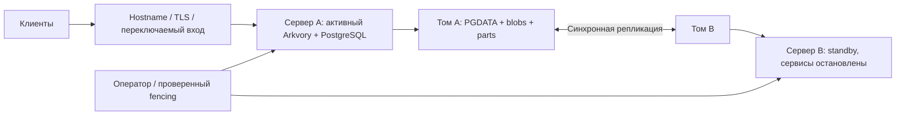

# Два сервера с репликацией

Требование владельца: два сервера с репликацией; испытания на стенде отложены. Этот документ — проект развёртывания, **не отчёт о работающем HA**. Текущий runtime сохраняет одного writer и одного worker. Дополнительные [read gateways](READ_GATEWAYS.md) поддерживают только согласованное общее хранилище и общий primary PostgreSQL; этот профиль не включает репликацию. Нельзя «включать» второй writer удалением advisory lock.

## Текущий инкремент и необходимые решения

Реализовано ограниченное подтверждение владения PostgreSQL-сессией: heartbeat каждые 2 секунды, deadline запроса 2 секунды, локальное окно не более 8 секунд, необратимая потеря владения. Это закрывает зависимость обнаружения молчаливого обрыва от TCP keepalive, но не заменяет физический fencing. [ADR 0042](adr/0042-bounded-storage-ownership.md).

До выбора реализации нужно согласовать два свойства развёртывания:

1. Допускается ли независимый арбитр/внешняя HA PostgreSQL или остаются строго два сервера с управляемым переключением после подтверждённого fencing.
2. Подтверждается ли запись только после двух устойчивых копий с остановкой записи при потере одной, либо допускается асинхронное зеркало с ненулевым RPO.

Кластер и зеркало должны иметь разные правила. Синхронный кандидат на writer обязан содержать все подтверждённые данные и каталог. Асинхронное зеркало не может автоматически стать writer с обещанием отсутствия потери. Чтение с зеркала требует проверки наличия содержимого и действующих прав; stale ACL недопустим. Согласованность metadata, вложений, tombstones и GC входит в репликационный протокол вместе с bytes; простого копирования blobs недостаточно.

## Предлагаемый первый профиль

Для двух Linux-серверов — active/passive с внешней синхронной репликацией блочного тома (кандидат DRBD protocol C), PostgreSQL и Arkvory на одном активном узле. На томе размещаются согласованно PGDATA и storage root. Приложение продолжает использовать local backend. Единственный файловый mount и один PostgreSQL writer; управление владением томом и fencing находятся вне TypeScript-приложения.

DRBD protocol C подтверждает связанную синхронную запись после записи на оба узла; режимы работы при разрыве связи и предотвращение split brain нужно настроить отдельно. Наличие `protocol C` само по себе не запрещает деградированные записи после отключения peer. Перед обещанием RPO=0 нужна проверенная блокировка записи при потере требуемой копии. См. [официальное руководство LINBIT](https://linbit.com/drbd-user-guide/drbd-guide-9_0-en/).

С двумя голосующими узлами потеря связи не доказывает отказ соседа. Начальный failover — управляемый, после подтверждённого отключения старого writer через независимый канал питания/гипервизора. Автоматизация возможна после выбора и испытания fencing; независимый witness может улучшить арбитраж, но не является третьей копией данных. Самодельный leader election в Arkvory не добавляется.

Если серверы Windows или блочная репликация недоступна, этот вариант не применять: выбрать поддерживаемый replicated filesystem/object storage и отдельно HA PostgreSQL. PostgreSQL streaming replication копирует данные БД, а не внешние blob-файлы; асинхронная репликация имеет окно потери. См. [документацию PostgreSQL](https://www.postgresql.org/docs/current/warm-standby.html). Независимые SQL/blob реплики требуют дополнительных publication/failover барьеров.

## Что подготовить перед запуском

| Компонент     | Требование                                                                                     |
| ------------- | ---------------------------------------------------------------------------------------------- |
| Диски         | Каждому узлу место на все 4 ТБ + рост + staging/parts + WAL; 4 ТБ на двоих недостаточно        |
| Сеть          | Измеренные RTT/полоса; replication и migration не должны вытеснять delivery                    |
| Том           | Поддерживаемая файловая система, один mount/writer, исправная синхронизация                    |
| БД            | Одинаковая версия на узлах, durable настройки, PGDATA в согласованной схеме репликации         |
| Fencing       | Независимое подтверждение, что прежний writer остановлен; журнал переключений                  |
| Вход          | TLS/hostname, проверка readiness с защищённым ключом, отключённая буферизация больших запросов |
| Backup        | Независимая копия и чистое восстановление; реплика не backup                                   |
| Наблюдаемость | Лаг/состояние реплики, свободное место, очередь, ошибки hashes, доступность read/write         |

## Последовательность переключения

1. Зафиксировать инцидент, прекратить новые записи; не автоматически запускать второй writer по одному тайм-ауту HTTP.
2. Выполнить и проверить fencing прежнего активного узла. Если проверить нельзя — не повышать standby.
3. Проверить состояние/актуальность реплики. При несинхронной копии принять фактический RPO до продвижения; не выдавать устаревшие подтверждения за нулевую потерю.
4. Перевести том в primary и смонтировать только на новом активном узле. Запустить PostgreSQL, дождаться recovery; проверить соответствие storage-id БД.
5. Запустить API/worker, проверить authenticated readiness, публикацию тестового объекта и Range download. Переключить вход. Незавершённые jobs/parts продолжатся с сохранённого состояния.
6. Старый узел возвращать как standby после resync. Автоматического failback нет.

## Балансировка

В standalone уже есть локальный исполнитель сетевого бюджета: [TRAFFIC_CONTROL](TRAFFIC_CONTROL.md). Его общий/per-principal лимит относится только к одному процессу. Для нескольких read gateways реализованы фиксированные доли и конечные leases: [READ_GATEWAYS](READ_GATEWAYS.md). Нельзя запускать независимые процессы с полным лимитом каждого вместо этого профиля.

Active/passive обеспечивает резерв, но не суммирует полосу двух независимых читающих backend. Текущие очереди ограничивают один шлюз. Реализованы readers с общим согласованным root и фиксированным бюджетом; проверенные локальные копии, подтверждение репликации и динамическое перераспределение полосы остаются отдельным этапом. Нельзя раздавать blob с replica, пока его наличие и SHA не подтверждены, или перенаправлять клиента на узел без соответствующих прав.

## Отложенные стендовые проверки

Отключение питания active, обрыв replication-сети, разделение сети, потеря fencing, заполнение тома/WAL, перезапуск в середине parts/complete, восстановление после потери подтверждения, возврат старого primary, clean backup restore, mixed upload/download/replication и 4 ТБ inventory. Измерить RPO/RTO и p95/p99 до утверждения SLA. Конфигурации DRBD/Pacemaker/VIP не применялись; ОС, диски, fencing и сеть ещё не выбраны.

Подробный реестр исправленных дефектов runtime и незакрытых требований репликации, fencing, зеркал и GC: [аудит кластерной готовности 2026-09-26](CLUSTER_AUDIT_2026-09-26.md).
